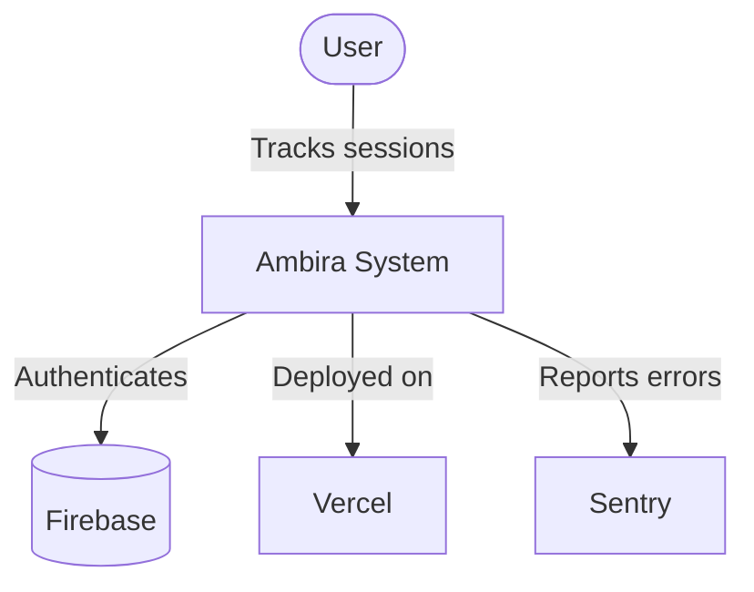
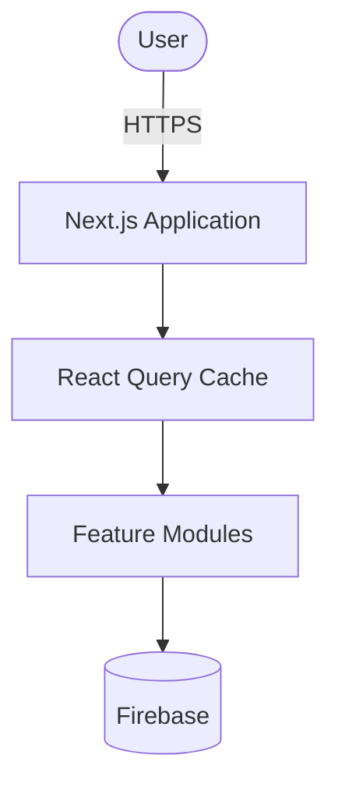
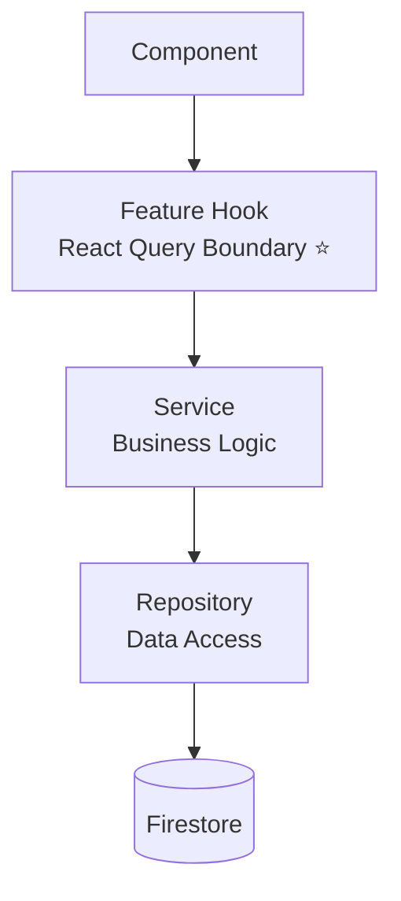

# Ambira Architecture Documentation

Complete architectural overview of the Ambira social productivity tracking platform.

## Table of Contents

1. [Overview](#overview)
2. [Architecture Diagrams](#architecture-diagrams)
3. [Key Architectural Principles](#key-architectural-principles)
4. [Technology Stack](#technology-stack)
5. [Core Patterns](#core-patterns)
6. [Related Documentation](#related-documentation)

## Overview

Ambira is a social productivity tracking application inspired by Strava - a "Strava for Productivity". Users track work sessions on projects, build streaks, follow friends, join groups, and compete in challenges.

### Key Features

- **Session Tracking**: Timer-based work session tracking with persistence
- **Social Feed**: Activity feed with sessions as primary content type
- **Social Graph**: Following system with privacy controls
- **Groups & Challenges**: Social communities and competitions
- **Real-time Sync**: Cross-tab timer synchronization
- **Analytics**: Personal productivity insights and statistics

## Architecture Diagrams

### C4 Model Hierarchy

The architecture is documented using the C4 model, providing multiple levels of detail:

#### [Level 1: System Context](./diagrams/01-system-context.md)

High-level view of Ambira and its interactions with users and external systems.

**Key Elements**:

- End users (web browsers)
- Ambira application (Next.js + Firebase)
- External systems (Vercel, Sentry, Email)



**[→ View Full System Context Diagram](./diagrams/01-system-context.md)**

---

#### [Level 2: Container Diagram](./diagrams/02-container-diagram.md)

Technology containers that make up the Ambira application.

**Key Containers**:

- **Next.js Application**: Frontend + Server Components
- **React Query**: Feature boundary caching layer
- **Feature Modules**: Clean architecture with hooks, services, repositories
- **Firebase Backend**: Authentication, Firestore, Cloud Storage
- **External Services**: Sentry monitoring



**[→ View Full Container Diagram](./diagrams/02-container-diagram.md)**

---

#### [Level 3: Component Diagram](./diagrams/03-component-diagram.md)

Internal component structure of a feature module following Clean Architecture.

**Layers**:

1. **Page Layer**: App Router pages and layouts
2. **Component Layer**: Pure presentation components
3. **Feature Hooks Layer** ⭐: React Query boundary (ONLY place for useQuery/useMutation)
4. **Service Layer**: Pure business logic (no React)
5. **Domain Layer**: Business rules and validation
6. **Repository Layer**: Data access (Firestore operations)
7. **Infrastructure Layer**: Firebase config, utilities



**[→ View Full Component Diagram](./diagrams/03-component-diagram.md)**

---

### Data Flow Sequence Diagrams

#### [Authentication Flow](./diagrams/04-authentication-flow.md)

User authentication from login to authorized access.

**Flows Covered**:

- Login with email/password
- Token verification and refresh
- Signup and user creation
- Logout and cleanup

**[→ View Authentication Flow](./diagrams/04-authentication-flow.md)**

---

#### [Session Creation Flow](./diagrams/05-session-creation-flow.md)

How users create and track work sessions with the timer.

**Flows Covered**:

- Starting a session with timer
- Timer running and persistence (heartbeat)
- Completing a session with notes
- Canceling an active session
- Browser crash recovery

**[→ View Session Creation Flow](./diagrams/05-session-creation-flow.md)**

---

#### [Feed Loading Flow](./diagrams/06-feed-loading-flow.md)

Social feed loading with React Query caching strategy.

**Flows Covered**:

- Initial feed load (cache miss)
- Cached load (cache hit, instant)
- Background refetch (stale-while-revalidate)
- Infinite scroll pagination
- Feed type switching (Following → Trending)
- Cache invalidation on new session

**[→ View Feed Loading Flow](./diagrams/06-feed-loading-flow.md)**

---

#### [Social Interactions Flow](./diagrams/07-social-interactions-flow.md)

User engagement through supports (likes) and comments with optimistic updates.

**Flows Covered**:

- Supporting a session (optimistic update)
- Unsupporting a session
- Adding a comment (temp → real ID)
- Deleting a comment
- Loading comments with pagination

**[→ View Social Interactions Flow](./diagrams/07-social-interactions-flow.md)**

---

#### [Real-time Timer Sync](./diagrams/08-realtime-timer-sync.md)

Timer state synchronization across tabs and browser crashes.

**Flows Covered**:

- Cross-tab synchronization (localStorage events)
- Browser crash recovery (Firestore persistence)
- Network failure handling
- Heartbeat persistence strategy
- Timer state management

**[→ View Real-time Timer Sync](./diagrams/08-realtime-timer-sync.md)**

---

### Infrastructure Diagrams

#### [Deployment Architecture](./diagrams/09-deployment-architecture.md)

Complete deployment infrastructure and CI/CD pipeline.

**Components**:

- **Development Environment**: Local setup, tooling
- **CI/CD Pipeline**: GitHub Actions (lint, test, build, security)
- **Vercel Edge Network**: Global CDN, serverless functions
- **Firebase Backend**: Auth, Firestore, Cloud Storage
- **Monitoring**: Sentry, Vercel Analytics, Firebase Performance

**[→ View Deployment Architecture](./diagrams/09-deployment-architecture.md)**

---

## Key Architectural Principles

### 1. React Query at Feature Boundaries ⭐

**The Core Pattern**: React Query (useQuery/useMutation) is ONLY used in feature hooks, never in components or services.

```
Components (UI)
    ↓
Feature Hooks (React Query Boundary) ← ONLY place for useQuery/useMutation
    ↓
Services (Business Logic)
    ↓
Repositories (Data Access)
    ↓
Firebase/Firestore
```

**Benefits**:

- Clear separation of concerns
- Improved testability (services are pure)
- Consistent caching strategy
- Easy to reason about data flow

**See**: [CACHING_STRATEGY.md](./CACHING_STRATEGY.md) for complete details

### 2. Sessions as Primary Content Type

**Critical**: Sessions ARE the posts. There is NO separate Post type in active use.

```typescript
// ✅ Correct
interface Session {
  // Session data
  supportCount: number;
  commentCount: number;
  visibility: 'everyone' | 'followers' | 'private';
}

// ❌ Wrong - Post type is deprecated
interface Post {
  sessionId?: string; // Don't use this pattern
}
```

**Feed Display**: The feed shows sessions directly with social engagement fields.

### 3. Clean Architecture Layers

Each feature follows a consistent layered architecture:

```
src/features/[feature]/
├── components/      # Presentation only, no data fetching
├── hooks/           # ⭐ React Query boundary
├── services/        # Business logic (no React)
├── domain/          # Business rules (optional)
├── repositories/    # Data access (optional)
└── types/           # Feature-specific types
```

**Key Rules**:

- Components never call Firestore directly
- Services are pure (testable without React)
- Hooks handle caching and optimistic updates
- Repositories handle data transformation

### 4. Optimistic Updates for Instant UX

All user interactions use optimistic updates:

```typescript
useMutation({
  mutationFn: supportSession,
  onMutate: async ({ sessionId }) => {
    // 1. Cancel ongoing queries
    await queryClient.cancelQueries(['sessions', sessionId]);

    // 2. Snapshot previous state
    const previous = queryClient.getQueryData(['sessions', sessionId]);

    // 3. Optimistically update UI
    queryClient.setQueryData(['sessions', sessionId], old => ({
      ...old,
      supportCount: old.supportCount + 1,
      isSupported: true,
    }));

    return { previous }; // For rollback
  },
  onError: (err, vars, context) => {
    // Rollback on error
    queryClient.setQueryData(['sessions', sessionId], context.previous);
  },
});
```

**Result**: User sees instant feedback (0ms), with server confirmation following.

### 5. Three-Tier Timer Persistence

Timer state survives browser crashes using three storage layers:

1. **React State** (TimerContext): In-memory, instant updates
2. **localStorage**: Cross-tab sync via storage events
3. **Firestore**: Server persistence with 30-second heartbeat

**Recovery Flow**:

```
Browser Crash → Firestore has last heartbeat
              → On reopen, restore from startTime
              → Timer resumes with correct elapsed time
```

### 6. Hierarchical Cache Keys

Cache keys follow a hierarchical pattern for efficient invalidation:

```typescript
const FEATURE_KEYS = {
  all: () => ['feature'] as const,
  lists: () => [...FEATURE_KEYS.all(), 'list'] as const,
  list: (filter: string) => [...FEATURE_KEYS.lists(), { filter }] as const,
  details: () => [...FEATURE_KEYS.all(), 'detail'] as const,
  detail: (id: string) => [...FEATURE_KEYS.details(), id] as const,
};
```

**Invalidation Examples**:

```typescript
// Invalidate everything
queryClient.invalidateQueries({ queryKey: FEATURE_KEYS.all() });

// Invalidate all lists
queryClient.invalidateQueries({ queryKey: FEATURE_KEYS.lists() });

// Invalidate one item
queryClient.invalidateQueries({ queryKey: FEATURE_KEYS.detail('123') });
```

## Technology Stack

### Frontend

- **Framework**: Next.js 15 (App Router)
- **UI Library**: React 19
- **Language**: TypeScript (strict mode)
- **Styling**: Tailwind CSS v4
- **Components**: shadcn/ui (Radix UI primitives)
- **State Management**: React Query (TanStack Query)
- **Forms**: React Hook Form + Zod validation

### Backend

- **Authentication**: Firebase Auth
- **Database**: Firestore (NoSQL)
- **Storage**: Firebase Cloud Storage
- **Security**: Firestore Security Rules

### Infrastructure

- **Hosting**: Vercel (Edge Network)
- **CI/CD**: GitHub Actions
- **Monitoring**: Sentry (errors), Vercel Analytics (performance)
- **Version Control**: Git + GitHub

### Development Tools

- **Package Manager**: npm (no Yarn/pnpm)
- **Linting**: ESLint
- **Formatting**: Prettier
- **Testing**: Jest (unit/integration), Playwright (E2E)
- **Type Checking**: TypeScript compiler

## Core Patterns

### Data Fetching Pattern

```typescript
// 1. Define cache keys
export const SESSIONS_KEYS = {
  all: () => ['sessions'] as const,
  user: (userId: string) => [...SESSIONS_KEYS.all(), 'user', userId] as const,
};

// 2. Create query hook
export function useUserSessions(userId: string) {
  return useQuery({
    queryKey: SESSIONS_KEYS.user(userId),
    queryFn: () => sessionService.getUserSessions(userId),
    staleTime: 5 * 60 * 1000, // 5 minutes
  });
}

// 3. Use in component
function UserProfile({ userId }: { userId: string }) {
  const { data: sessions, isLoading } = useUserSessions(userId);

  if (isLoading) return <Loading />;
  return <SessionList sessions={sessions} />;
}
```

### Mutation Pattern with Optimistic Update

```typescript
export function useCreateSession() {
  const queryClient = useQueryClient();

  return useMutation({
    mutationFn: data => sessionService.createSession(data),

    onMutate: async newSession => {
      // Optimistic update (instant UI feedback)
      await queryClient.cancelQueries({ queryKey: ['sessions'] });
      const previous = queryClient.getQueryData(['sessions']);

      queryClient.setQueryData(['sessions'], old => [newSession, ...old]);

      return { previous };
    },

    onError: (err, newSession, context) => {
      // Rollback on error
      queryClient.setQueryData(['sessions'], context.previous);
    },

    onSuccess: () => {
      // Invalidate and refetch
      queryClient.invalidateQueries({ queryKey: ['sessions'] });
    },
  });
}
```

### Service Pattern (Pure Business Logic)

```typescript
// services/SessionService.ts
export class SessionService {
  private sessionRepo: SessionRepository;

  constructor() {
    this.sessionRepo = new SessionRepository();
  }

  async createSession(
    userId: string,
    data: CreateSessionData
  ): Promise<Session> {
    // Validation
    if (!data.projectId) {
      throw new Error('Project ID is required');
    }

    // Business logic
    const session = {
      id: generateId(),
      userId,
      ...data,
      supportCount: 0,
      commentCount: 0,
      createdAt: new Date(),
    };

    // Persist
    await this.sessionRepo.create(session);

    // Side effects
    await this.updateProjectStats(data.projectId);
    await this.updateUserStreak(userId);

    return session;
  }

  private async updateProjectStats(projectId: string): Promise<void> {
    // Update logic
  }

  private async updateUserStreak(userId: string): Promise<void> {
    // Streak logic
  }
}
```

## Related Documentation

### Core Architecture

- **[CACHING_STRATEGY.md](./CACHING_STRATEGY.md)**: React Query at feature boundaries pattern
- **[EXAMPLES.md](./EXAMPLES.md)**: Complete implementation examples
- **[MIGRATION_GUIDE.md](./MIGRATION_GUIDE.md)**: Migrating to React Query pattern

### Context Elimination Strategy

- **[CONTEXT_ELIMINATION_SUMMARY.md](./CONTEXT_ELIMINATION_SUMMARY.md)**: Executive summary
- **[CONTEXT_ELIMINATION_STRATEGY.md](./CONTEXT_ELIMINATION_STRATEGY.md)**: Comprehensive migration plan
- **[CONTEXT_ELIMINATION_DIAGRAMS.md](./CONTEXT_ELIMINATION_DIAGRAMS.md)**: Visual diagrams

### Implementation & Tools

- **[TOOLING.md](./TOOLING.md)**: CLI scaffolder, VSCode snippets, utilities
- **[MIGRATION_STATUS.md](./MIGRATION_STATUS.md)**: Current migration progress
- **[SUMMARY.md](./SUMMARY.md)**: Implementation summary and status

### Project Documentation

- **[/CLAUDE.md](../../CLAUDE.md)**: Project overview for Claude Code
- **[/README.md](../../README.md)**: Project setup and getting started
- **[/docs/testing/](../testing/)**: Testing strategy and guides

## Quick Start for New Developers

1. **Read System Context** → Understand overall architecture
2. **Review Caching Strategy** → Learn React Query pattern
3. **Study Examples** → See complete implementations
4. **Follow Migration Guide** → When adding new features

## Contributing to Architecture

When proposing architectural changes:

1. **Document the change**: Update relevant diagrams and docs
2. **Explain the reasoning**: Why is this better than current approach?
3. **Provide examples**: Show before/after code
4. **Update migration guide**: How should existing code be updated?
5. **Get team review**: Architecture changes require consensus

## Questions?

- Check the [FAQ in MIGRATION_GUIDE.md](./MIGRATION_GUIDE.md#faq)
- Review [EXAMPLES.md](./EXAMPLES.md) for similar patterns
- Ask the team in discussions

---

**Last Updated**: 2025-01-XX
**Architecture Version**: 1.0
**Next Review**: Quarterly
