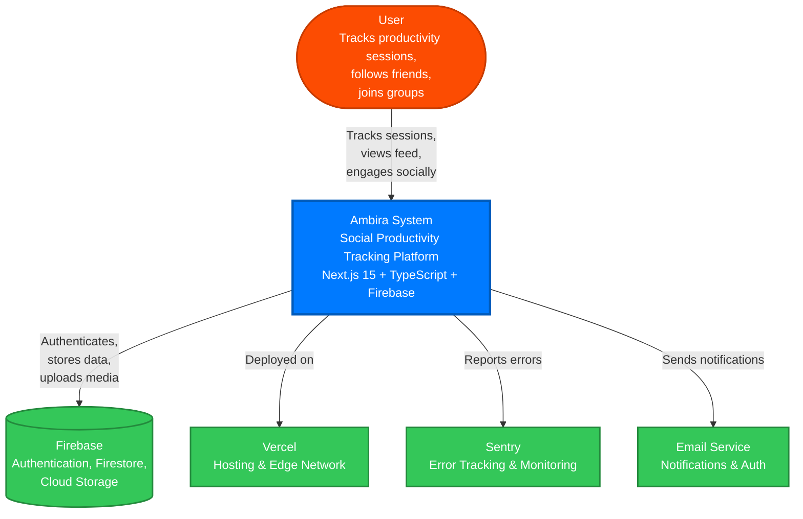

# System Context Diagram (C4 Level 1)

This diagram shows the highest level view of the Ambira system and how it interacts with users and external systems.

## Key Elements

### Users

- End users who track their productivity sessions
- Follow friends and view their activity
- Join groups and participate in challenges
- Engage with social features (supports, comments)

### Ambira System

The central application providing:

- Session tracking and timer functionality
- Social feed and following system
- Groups and challenges
- Analytics and insights
- Project/activity management

### External Systems

**Firebase**

- Authentication (email/password, social login)
- Firestore database for all application data
- Cloud Storage for profile pictures and media

**Vercel**

- Edge network deployment
- Serverless function hosting
- CDN for static assets
- Automatic deployments from Git

**Sentry**

- Real-time error tracking
- Performance monitoring
- Release tracking
- User feedback integration

**Email Service**

- Authentication emails (password reset, verification)
- Notification emails (optional future feature)
