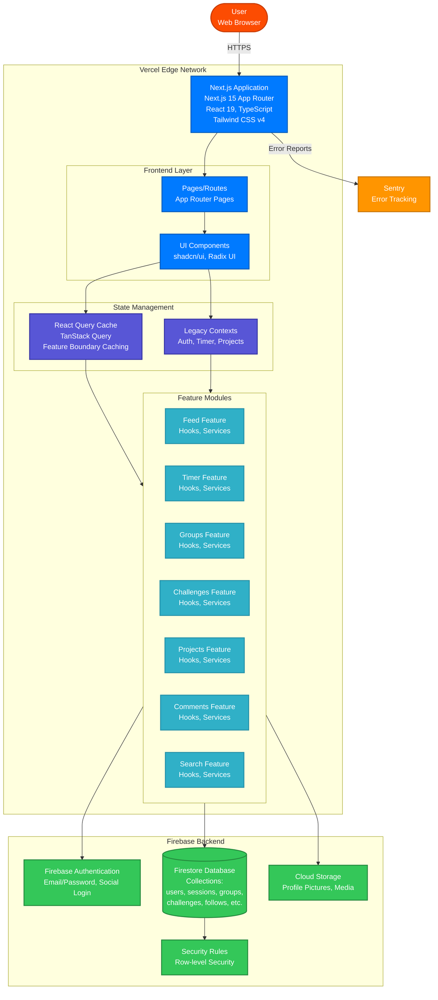

# Container Diagram (C4 Level 2)

This diagram shows the high-level technology containers that make up the Ambira application.

## Container Descriptions

### Next.js Application (Frontend)

**Technology**: Next.js 15, React 19, TypeScript, Tailwind CSS v4
**Responsibilities**:

- Server-side rendering and static generation
- App Router-based routing
- Client-side interactivity
- State management coordination

**Key Sub-containers**:

#### Pages/Routes

- App Router pages (`src/app/**`)
- Server and client components
- Route handlers for API endpoints
- Layout and template definitions

#### UI Components

- Presentation components (`src/components/`)
- shadcn/ui component library
- Radix UI primitives
- Reusable UI patterns

### State Management Layer

#### React Query Cache

**Technology**: TanStack Query (React Query)
**Responsibilities**:

- Feature boundary caching pattern
- Declarative data fetching
- Optimistic updates
- Cache invalidation
- Background refetching

**Located in**: `src/features/*/hooks/`

#### Legacy Contexts

**Technology**: React Context API
**Status**: Being migrated to React Query
**Current Contexts**:

- `AuthContext` - User authentication state
- `TimerContext` - Active timer state
- `ProjectsContext` - Project management
- ~~`ActivitiesContext`~~ - Deprecated
- ~~`NotificationsContext`~~ - Deprecated

### Feature Modules

Clean architecture pattern with:

- **Hooks**: React Query boundaries (`use*.ts`)
- **Services**: Business logic (`*Service.ts`)
- **Components**: Feature-specific UI
- **Types**: Feature-specific TypeScript types

**Active Features**:

- Feed (sessions feed with social engagement)
- Timer (session tracking and persistence)
- Groups (social groups and membership)
- Challenges (competitions and leaderboards)
- Projects/Activities (work categorization)
- Comments (social interactions)
- Search (users and content discovery)

### Firebase Backend

#### Firebase Authentication

- Email/password authentication
- Social login providers (Google, GitHub, etc.)
- Session management
- User token handling

#### Firestore Database

**Collections**:

- `users` - User profiles and settings
- `sessions` - Work sessions (primary content type)
- `projects/{userId}/userProjects` - User's projects
- `groups` - Social groups
- `challenges` - Competitions
- `challengeParticipants` - Challenge participation
- `follows` - Social graph (follower/following)
- `comments` - Session comments
- `supports` - Session likes/supports
- `streaks` - Streak tracking
- `achievements` - User achievements

#### Cloud Storage

- Profile pictures
- Future: Session media attachments

#### Security Rules

- Row-level security for all collections
- Visibility-based access control
- User-scoped permissions
- Increment-only operations for counts

### External Services

#### Sentry

- Real-time error tracking
- Performance monitoring
- Source map upload for debugging
- Optional (can be disabled)

## Data Flow

1. **User Request** → Vercel Edge Network
2. **SSR/SSG** → Next.js renders initial page
3. **Client Hydration** → React takes over
4. **Data Fetching** → React Query hooks in features
5. **Business Logic** → Feature services
6. **Data Access** → Firestore repositories
7. **Real-time Updates** → Firestore listeners (timer, notifications)

## Caching Strategy

### React Query at Feature Boundaries

- Queries and mutations only in `src/features/*/hooks/`
- Hierarchical cache keys per feature
- Optimistic updates for instant feedback
- Automatic background refetching
- See [CACHING_STRATEGY.md](../CACHING_STRATEGY.md) for details

### Cache Time Patterns

- **Real-time**: 30s (active timer, live notifications)
- **Short**: 1m (feed, search results)
- **Medium**: 5m (session details, comments)
- **Long**: 15m (user profiles, groups)
- **Very Long**: 1h (stats, analytics)

## Deployment

- **Platform**: Vercel
- **Build**: Automatic on Git push
- **Edge Network**: Global CDN
- **Serverless Functions**: API routes and server components
- **Environment**: Production, Preview, Development
