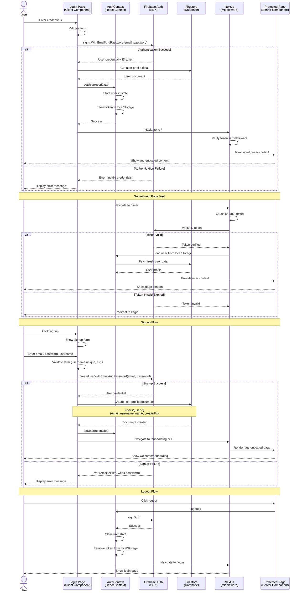

# Authentication Flow Sequence Diagram

This diagram shows the complete user authentication flow from login to authorized access.



## Flow Details

### 1. Login Flow

**User Actions**:

1. User navigates to `/login`
2. Enters email and password
3. Clicks "Sign In" button

**System Processing**:

1. **Form Validation**: Client-side validation of email format and password requirements
2. **Firebase Authentication**:
   - `signInWithEmailAndPassword(email, password)`
   - Returns user credential with ID token
3. **Profile Fetch**:
   - Query Firestore for user profile: `/users/{userId}`
   - Retrieve user metadata (username, name, bio, etc.)
4. **Context Update**:
   - Store user object in `AuthContext`
   - Persist ID token to `localStorage`
5. **Navigation**:
   - Redirect to home page `/`
   - Middleware verifies token
   - Protected page renders with user context

**Error Handling**:

- Invalid credentials → Display error message
- Network error → Retry prompt
- User not found in Firestore → Create basic profile

### 2. Token Verification Flow

**Triggered On**:

- Page refresh
- Navigating to protected route
- App initialization

**Process**:

1. **Check localStorage**: Look for stored auth token
2. **Verify Token**:
   - Call `FirebaseAuth.currentUser`
   - Validate token with Firebase
3. **Refresh User Data**:
   - Fetch latest user profile from Firestore
   - Update `AuthContext` state
4. **Render Page**:
   - If valid: show protected content
   - If invalid: redirect to `/login`

**Token Lifecycle**:

- Tokens expire after 1 hour
- Firebase SDK auto-refreshes tokens
- Manual refresh on app focus

### 3. Signup Flow

**User Actions**:

1. Click "Sign Up" link from login page
2. Enter email, password, username, name
3. Click "Create Account"

**System Processing**:

1. **Form Validation**:
   - Email format check
   - Password strength (min 6 chars)
   - Username availability check (Firestore query)
2. **Create Firebase User**:
   - `createUserWithEmailAndPassword(email, password)`
   - Returns user credential
3. **Create User Profile**:
   ```typescript
   // /users/{userId}
   {
     id: userId,
     email: email,
     username: username,
     name: name,
     bio: '',
     profilePicture: '',
     followersCount: 0,
     followingCount: 0,
     createdAt: serverTimestamp(),
     updatedAt: serverTimestamp(),
   }
   ```
4. **Auto-Login**:
   - Set user in `AuthContext`
   - Navigate to home or onboarding

**Validation Rules**:

- Username must be unique (Firestore query)
- Username 3-20 characters, alphanumeric + underscore
- Email must be valid format
- Password minimum 6 characters

### 4. Logout Flow

**User Actions**:

1. Click "Logout" in settings or menu

**System Processing**:

1. **Sign Out**: `FirebaseAuth.signOut()`
2. **Clear State**:
   - Remove user from `AuthContext`
   - Clear `localStorage` token
3. **Navigation**: Redirect to `/login`
4. **Cleanup**: Clear any cached user data

## Authentication State

### AuthContext State

```typescript
interface AuthState {
  user: User | null // Current user or null if not authenticated
  loading: boolean // Loading during initial auth check
  error: string | null // Authentication error message
}
```

### Protected Routes

Routes that require authentication:

- `/` - Home feed
- `/timer` - Session timer
- `/profile/*` - User profiles
- `/groups/*` - Groups and challenges
- `/settings/*` - User settings
- `/analytics` - Analytics dashboard

### Public Routes

Routes accessible without authentication:

- `/login` - Login page
- `/signup` - Signup page
- `/forgot-password` - Password reset

## Security Considerations

### Token Storage

- **ID tokens** stored in `localStorage` (not cookies)
- Tokens refresh automatically via Firebase SDK
- Manual token refresh on app focus

### Security Rules

Firestore security rules enforce:

- Users can only read their own private data
- Public profiles visible based on privacy settings
- Write operations validated server-side

### Best Practices

- Never store passwords client-side
- Use HTTPS only (enforced by Firebase)
- Validate all inputs server-side
- Rate limit authentication attempts (Firebase default)
- Email verification for signups (optional, can be enabled)

## Edge Cases

### Token Expiration During Session

- Firebase SDK auto-refreshes tokens
- If refresh fails, redirect to login
- User notified: "Session expired, please log in again"

### Concurrent Sessions

- Multiple tabs share same auth state (localStorage)
- Logout in one tab logs out all tabs
- `storage` event listener syncs auth state

### Network Failures

- Retry authentication request
- Show network error message
- Persist form data for retry

### Username Conflicts

- Real-time validation during signup
- Suggest alternatives if taken
- Case-insensitive uniqueness check

## Future Enhancements

### Potential Additions

- Social login (Google, GitHub)
- Multi-factor authentication (MFA)
- Email verification requirement
- Magic link authentication
- Biometric authentication (mobile)
- Session management (view all sessions, revoke)
