# Session Creation Flow Sequence Diagram

This diagram shows how users create and track work sessions with the timer functionality.

```mermaid
sequenceDiagram
    actor User
    participant TimerPage as Timer Page<br/>(Client Component)
    participant TimerContext as TimerContext<br/>(React Context)
    participant useTimer as useTimer Hook<br/>(React Query)
    participant TimerService as TimerService<br/>(Business Logic)
    participant Firestore as Firestore<br/>(Database)
    participant ActiveSessionStore as Active Session<br/>(Subcollection)
    participant SessionsCollection as Sessions<br/>(Collection)
    participant FeedHook as useFeed Hook<br/>(React Query)

    %% Starting a Session
    Note over User,FeedHook: Starting a Session

    User->>TimerPage: Select project
    User->>TimerPage: Set start time (optional)
    User->>TimerPage: Click "Start Session"

    TimerPage->>TimerContext: startSession(projectId, startTime)
    TimerContext->>useTimer: mutate({ projectId, startTime })
    useTimer->>TimerService: startSession(userId, projectId, startTime)

    TimerService->>TimerService: Create session object
    Note over TimerService: {<br/>  userId, projectId,<br/>  startTime: now or custom,<br/>  status: 'active',<br/>  visibility: 'followers'<br/>}

    TimerService->>ActiveSessionStore: Save to /users/{userId}/activeSession/{sessionId}
    ActiveSessionStore-->>TimerService: Session persisted

    TimerService->>TimerContext: Return active session
    TimerContext->>TimerContext: Update local state
    TimerContext->>TimerContext: Start elapsed time ticker

    useTimer->>useTimer: Optimistic update
    Note over useTimer: Cache active session<br/>queryKey: ['timer', userId]

    useTimer-->>TimerPage: Session started
    TimerPage-->>User: Show active timer (00:00:00)

    %% Timer Running
    Note over User,FeedHook: Timer Running

    loop Every Second
        TimerContext->>TimerContext: Calculate elapsed time
        TimerContext->>TimerPage: Update display
        TimerPage-->>User: Show elapsed time (01:23:45)
    end

    loop Every 30 Seconds
        TimerContext->>ActiveSessionStore: Update active session (heartbeat)
        Note over ActiveSessionStore: Persist current state<br/>in case of browser crash
    end

    %% User Switches Tabs
    User->>User: Switch to another tab/close browser
    TimerContext->>ActiveSessionStore: Final heartbeat save
    ActiveSessionStore-->>TimerContext: Persisted

    User->>User: Reopen browser/tab
    TimerPage->>TimerContext: Component mount
    TimerContext->>useTimer: Fetch active session
    useTimer->>TimerService: getActiveSession(userId)
    TimerService->>ActiveSessionStore: Query /users/{userId}/activeSession
    ActiveSessionStore-->>TimerService: Active session data
    TimerService-->>useTimer: Active session
    useTimer->>TimerContext: Restore session
    TimerContext->>TimerContext: Calculate elapsed time from startTime
    TimerContext-->>TimerPage: Resume timer display
    TimerPage-->>User: Show resumed timer (01:27:18)

    %% Completing a Session
    Note over User,FeedHook: Completing a Session

    User->>TimerPage: Click "Complete Session"
    TimerPage->>TimerPage: Show completion modal
    User->>TimerPage: Add notes (optional)
    User->>TimerPage: Set visibility (everyone/followers/private)
    User->>TimerPage: Click "Save"

    TimerPage->>TimerContext: completeSession(notes, visibility)
    TimerContext->>useTimer: mutate({ sessionId, notes, visibility })
    useTimer->>TimerService: completeSession(sessionId, userId, notes, visibility)

    TimerService->>TimerService: Calculate duration
    Note over TimerService: duration = now - startTime<br/>Convert to hours

    TimerService->>SessionsCollection: Create /sessions/{sessionId}
    Note over SessionsCollection: {<br/>  userId, projectId,<br/>  startTime, endTime,<br/>  duration, notes,<br/>  visibility,<br/>  status: 'completed',<br/>  supportCount: 0,<br/>  commentCount: 0,<br/>  createdAt: serverTimestamp()<br/>}
    SessionsCollection-->>TimerService: Session created

    TimerService->>ActiveSessionStore: Delete /users/{userId}/activeSession/{sessionId}
    ActiveSessionStore-->>TimerService: Deleted

    TimerService->>Firestore: Update project stats
    Note over Firestore: Increment totalHours,<br/>sessionCount

    TimerService->>Firestore: Update user streak
    Note over Firestore: Check if consecutive day,<br/>update current/longest streak

    TimerService-->>useTimer: Session completed
    useTimer->>useTimer: Invalidate cache
    Note over useTimer: Invalidate:<br/>- ['timer', userId]<br/>- ['feed']<br/>- ['sessions', userId]<br/>- ['projects', userId]

    useTimer->>FeedHook: Cache invalidated
    FeedHook->>FeedHook: Refetch feed data
    FeedHook->>Firestore: Query sessions
    Firestore-->>FeedHook: Updated feed with new session

    useTimer-->>TimerContext: Success
    TimerContext->>TimerContext: Clear active session state
    TimerContext-->>TimerPage: Session completed
    TimerPage-->>User: Show success message
    TimerPage->>TimerPage: Navigate to feed or profile
    User->>User: See new session in feed

    %% Canceling a Session
    Note over User,FeedHook: Canceling a Session

    User->>TimerPage: Click "Cancel Session"
    TimerPage->>TimerPage: Show confirmation dialog
    User->>TimerPage: Confirm cancel

    TimerPage->>TimerContext: cancelSession()
    TimerContext->>useTimer: mutate({ sessionId, action: 'cancel' })
    useTimer->>TimerService: cancelSession(sessionId, userId)

    TimerService->>ActiveSessionStore: Delete /users/{userId}/activeSession/{sessionId}
    ActiveSessionStore-->>TimerService: Deleted

    TimerService-->>useTimer: Session canceled
    useTimer->>useTimer: Invalidate cache ['timer', userId]
    useTimer-->>TimerContext: Success
    TimerContext->>TimerContext: Clear active session state
    TimerContext-->>TimerPage: Session canceled
    TimerPage-->>User: Return to timer start screen
```



## Flow Details

### 1. Starting a Session

**User Actions**:

1. Navigate to `/timer`
2. Select a project from dropdown
3. Optionally set custom start time (default: now)
4. Click "Start Session"

**System Processing**:

**Data Creation**:

```typescript
const session = {
  id: generateId(),
  userId: currentUser.id,
  projectId: selectedProject.id,
  startTime: customTime || serverTimestamp(),
  endTime: null,
  duration: 0,
  status: 'active',
  notes: '',
  visibility: 'followers', // Default
  supportCount: 0,
  commentCount: 0,
}
```

**Persistence**:

1. **Active Session Storage**:
   - Path: `/users/{userId}/activeSession/{sessionId}`
   - Purpose: Survive browser refresh/crash
   - Auto-saves every 30 seconds (heartbeat)

2. **Context State**:
   - Store in `TimerContext` for UI reactivity
   - Start elapsed time ticker (updates every second)

3. **React Query Cache**:
   - Cache key: `['timer', userId]`
   - Optimistic update for instant UI feedback

**UI Updates**:

- Timer display shows 00:00:00
- "Complete" and "Cancel" buttons appear
- Active timer indicator in header

### 2. Timer Running & Persistence

**Elapsed Time Calculation**:

```typescript
// Every second
const elapsed = Math.floor((Date.now() - startTime) / 1000)
const hours = Math.floor(elapsed / 3600)
const minutes = Math.floor((elapsed % 3600) / 60)
const seconds = elapsed % 60
// Display: HH:MM:SS
```

**Heartbeat Persistence**:

- Every 30 seconds: Save current state to Firestore
- On tab switch/close: Final save
- Prevents data loss on browser crash

**Session Recovery**:

1. User reopens browser/tab
2. `TimerContext` checks for active session on mount
3. Query `/users/{userId}/activeSession`
4. If found, restore timer with calculated elapsed time
5. Resume ticker from current time

### 3. Completing a Session

**User Actions**:

1. Click "Complete Session"
2. Completion modal appears:
   - Notes field (optional)
   - Visibility dropdown (everyone/followers/private)
   - Duration preview
3. Click "Save"

**System Processing**:

**Duration Calculation**:

```typescript
const duration = (endTime - startTime) / (1000 * 60 * 60) // Hours
```

**Create Session Document**:

```typescript
// /sessions/{sessionId}
{
  id: sessionId,
  userId: currentUser.id,
  projectId: project.id,
  projectName: project.name,
  projectIcon: project.icon,
  projectColor: project.color,
  startTime: Timestamp,
  endTime: Timestamp,
  duration: 2.5, // hours
  notes: 'Completed feature X',
  visibility: 'followers',
  status: 'completed',
  supportCount: 0,
  commentCount: 0,
  createdAt: serverTimestamp(),
  updatedAt: serverTimestamp(),
}
```

**Side Effects (Batched)**:

1. **Delete Active Session**:
   - Remove from `/users/{userId}/activeSession`

2. **Update Project Stats**:

   ```typescript
   // /projects/{userId}/userProjects/{projectId}
   {
     totalHours: increment(2.5),
     sessionCount: increment(1),
     lastSessionDate: serverTimestamp(),
   }
   ```

3. **Update User Streak**:
   ```typescript
   // /streaks/{userId}
   - Check if session is on consecutive day
   - If yes: increment currentStreak
   - If no: reset currentStreak to 1
   - Update longestStreak if currentStreak > longestStreak
   ```

**Cache Invalidation**:

```typescript
queryClient.invalidateQueries({ queryKey: ['timer', userId] })
queryClient.invalidateQueries({ queryKey: ['feed'] })
queryClient.invalidateQueries({ queryKey: ['sessions', userId] })
queryClient.invalidateQueries({ queryKey: ['projects', userId] })
queryClient.invalidateQueries({ queryKey: ['streaks', userId] })
```

**UI Updates**:

- Success message: "Session completed!"
- Navigate to feed (shows new session)
- Clear timer state
- Reset to timer start screen

### 4. Canceling a Session

**User Actions**:

1. Click "Cancel Session"
2. Confirmation dialog: "Discard this session?"
3. Click "Confirm"

**System Processing**:

1. Delete active session from Firestore
2. Clear timer context state
3. Invalidate timer cache
4. No session document created
5. No stats updated
6. Return to timer start screen

## Data Models

### Active Session (Temporary)

```typescript
// /users/{userId}/activeSession/{sessionId}
interface ActiveSession {
  id: string
  userId: string
  projectId: string
  projectName: string
  projectIcon: string
  projectColor: string
  startTime: Timestamp
  lastHeartbeat: Timestamp // Updated every 30s
}
```

### Completed Session (Permanent)

```typescript
// /sessions/{sessionId}
interface Session {
  id: string
  userId: string
  projectId: string
  projectName: string
  projectIcon: string
  projectColor: string
  startTime: Timestamp
  endTime: Timestamp
  duration: number // hours
  notes: string
  visibility: 'everyone' | 'followers' | 'private'
  status: 'completed'
  supportCount: number
  commentCount: number
  createdAt: Timestamp
  updatedAt: Timestamp
}
```

## Edge Cases

### Browser Crash During Session

- Active session persisted in Firestore
- On next visit, session recovered from `/activeSession`
- Timer resumes from original startTime
- User can complete or cancel recovered session

### Multiple Tabs Open

- Only one active session per user (enforced)
- If user starts session in Tab A, Tab B sees updated state
- Storage event listener syncs timer state across tabs

### Network Failure

- Timer continues running locally
- Heartbeat saves queued until network restored
- On completion, retry save with exponential backoff
- User sees loading state during retry

### Session Spanning Midnight

- Start: 11:30 PM
- End: 12:30 AM (next day)
- Streak update logic handles date boundary
- Session counted on end date for analytics

### Very Long Sessions

- Sessions can run for days (edge case)
- Duration calculated correctly regardless
- No automatic timeout (user controls)
- Heartbeat continues indefinitely

### Custom Start Time

- User can set session start to past time
- Validates: not in future, not before user joined
- Useful for manually logging past work
- Affects streak calculation based on start date

## Performance Considerations

### Timer Ticker Optimization

- Use `setInterval` for 1-second updates
- Clear interval on unmount/completion
- Avoid re-renders of parent components
- Memoize calculated values

### Heartbeat Strategy

- 30-second interval balances persistence vs. performance
- Only updates if session state changed
- Uses Firestore `update()` not `set()` to avoid conflicts
- Debounce rapid start/stop actions

### Cache Management

- Active session cached for instant resume
- Invalidate related caches on completion
- Prefetch project list on timer page mount
- Use optimistic updates for instant feedback

## Future Enhancements

### Potential Features

- Session templates (pre-fill notes, tags)
- Pause/resume functionality
- Session splitting (break one session into multiple)
- Automatic session suggestions based on patterns
- Pomodoro timer mode (25 min intervals)
- Session reminders/notifications
- Collaborative sessions (track team time)
