# Feed Loading Flow with React Query

This diagram shows how the social feed loads sessions with React Query caching at feature boundaries.

```mermaid
sequenceDiagram
    actor User
    participant FeedPage as Feed Page<br/>(Server Component)
    participant FeedClient as Feed Client<br/>(Client Component)
    participant useFeed as useFeed Hook<br/>(React Query)
    participant ReactQuery as React Query<br/>(Cache)
    participant FeedService as FeedService<br/>(Business Logic)
    participant Firestore as Firestore<br/>(Database)
    participant SessionRepo as SessionRepository<br/>(Data Access)

    %% Initial Load
    Note over User,SessionRepo: Initial Feed Load (Cache Miss)

    User->>FeedPage: Navigate to /
    FeedPage->>FeedPage: Server-side render shell
    FeedPage->>FeedClient: Render with hydration
    FeedClient->>useFeed: useFeed(userId, 'following')

    useFeed->>ReactQuery: Check cache for ['feed', userId, 'following']
    ReactQuery-->>useFeed: Cache miss

    useFeed->>useFeed: Set isLoading = true
    useFeed-->>FeedClient: Return { data: undefined, isLoading: true }
    FeedClient-->>User: Show loading skeletons

    useFeed->>FeedService: getFeedSessions(userId, 'following', limit: 20)

    FeedService->>Firestore: Get user's following list
    Note over Firestore: Query /follows<br/>where followerId == userId
    Firestore-->>FeedService: [user2, user3, user4]

    FeedService->>SessionRepo: Query sessions from following
    SessionRepo->>Firestore: Query /sessions
    Note over Firestore: WHERE userId IN [user2, user3, user4]<br/>AND visibility IN ['everyone', 'followers']<br/>ORDER BY createdAt DESC<br/>LIMIT 20

    Firestore-->>SessionRepo: [session1, session2, ...]
    SessionRepo->>SessionRepo: Transform Firestore docs to Session objects

    SessionRepo->>Firestore: Fetch user data for each session
    Note over Firestore: Batch get /users/{userId}
    Firestore-->>SessionRepo: [user2, user3, user4] data

    SessionRepo->>Firestore: Fetch project data for each session
    Note over Firestore: Batch get /projects/{userId}/userProjects/{projectId}
    Firestore-->>SessionRepo: [project data]

    SessionRepo->>SessionRepo: Populate sessions with user & project data
    SessionRepo-->>FeedService: SessionWithDetails[]

    FeedService->>FeedService: Apply business rules (filter private, etc.)
    FeedService-->>useFeed: Processed feed sessions

    useFeed->>ReactQuery: Store in cache ['feed', userId, 'following']
    Note over ReactQuery: staleTime: 1 minute<br/>cacheTime: 5 minutes

    useFeed->>useFeed: Set isLoading = false, data = sessions
    useFeed-->>FeedClient: Return { data: sessions, isLoading: false }
    FeedClient-->>User: Display feed with sessions

    %% Cached Load
    Note over User,SessionRepo: Subsequent Load (Cache Hit)

    User->>FeedPage: Navigate away and back to /
    FeedPage->>FeedClient: Render
    FeedClient->>useFeed: useFeed(userId, 'following')

    useFeed->>ReactQuery: Check cache ['feed', userId, 'following']
    ReactQuery-->>useFeed: Cache hit (fresh, <1 min old)

    useFeed-->>FeedClient: Return cached data instantly
    FeedClient-->>User: Display feed immediately (no loading)

    %% Background Refetch (Stale)
    Note over User,SessionRepo: Background Refetch (Cache Stale)

    User->>User: Wait 2 minutes (staleTime passed)
    User->>FeedPage: Revisit /
    FeedClient->>useFeed: useFeed(userId, 'following')

    useFeed->>ReactQuery: Check cache ['feed', userId, 'following']
    ReactQuery-->>useFeed: Cache hit (stale, >1 min old)

    useFeed-->>FeedClient: Return stale data immediately
    FeedClient-->>User: Display feed instantly with stale data

    useFeed->>useFeed: Trigger background refetch
    useFeed->>FeedService: getFeedSessions(userId, 'following', 20)
    FeedService->>Firestore: Fetch latest sessions
    Firestore-->>FeedService: Updated sessions
    FeedService-->>useFeed: New data

    useFeed->>ReactQuery: Update cache
    useFeed-->>FeedClient: Update data silently
    FeedClient-->>User: Feed updates (smooth transition)

    %% Infinite Scroll
    Note over User,SessionRepo: Infinite Scroll (Load More)

    User->>FeedClient: Scroll to bottom of feed
    FeedClient->>FeedClient: Trigger intersection observer

    FeedClient->>useFeed: fetchNextPage()
    useFeed->>useFeed: Get lastVisible doc from previous page

    useFeed->>FeedService: getFeedSessions(userId, 'following', 20, lastVisible)
    FeedService->>SessionRepo: Query next page
    SessionRepo->>Firestore: Query /sessions
    Note over Firestore: WHERE userId IN [...]<br/>ORDER BY createdAt DESC<br/>START AFTER lastVisible<br/>LIMIT 20

    Firestore-->>SessionRepo: Next 20 sessions
    SessionRepo-->>FeedService: Populated sessions
    FeedService-->>useFeed: Next page data

    useFeed->>ReactQuery: Append to existing cache
    Note over ReactQuery: Infinite query pattern<br/>pages: [page1, page2, ...]

    useFeed-->>FeedClient: Return next page
    FeedClient-->>User: Append sessions to feed seamlessly

    %% Feed Type Switch
    Note over User,SessionRepo: Switch Feed Type (Following → Trending)

    User->>FeedClient: Click "Trending" tab
    FeedClient->>useFeed: useFeed(userId, 'trending')

    useFeed->>ReactQuery: Check cache ['feed', userId, 'trending']
    ReactQuery-->>useFeed: Cache miss (different key)

    useFeed->>useFeed: Set isLoading = true
    useFeed-->>FeedClient: Loading state
    FeedClient-->>User: Show loading skeletons

    useFeed->>FeedService: getFeedSessions(userId, 'trending', 20)
    FeedService->>SessionRepo: Query trending sessions
    SessionRepo->>Firestore: Query /sessions
    Note over Firestore: WHERE visibility == 'everyone'<br/>ORDER BY supportCount DESC, createdAt DESC<br/>LIMIT 20

    Firestore-->>SessionRepo: Trending sessions
    SessionRepo-->>FeedService: Populated sessions
    FeedService-->>useFeed: Trending feed

    useFeed->>ReactQuery: Store in cache ['feed', userId, 'trending']
    useFeed-->>FeedClient: Trending data
    FeedClient-->>User: Display trending feed

    %% Cache Invalidation (New Session Posted)
    Note over User,SessionRepo: Cache Invalidation (User Posts Session)

    User->>User: Complete a session
    FeedClient->>useFeed: Invalidate feed cache
    useFeed->>ReactQuery: invalidateQueries(['feed'])

    ReactQuery->>ReactQuery: Mark all feed caches as stale
    ReactQuery->>useFeed: Trigger refetch

    useFeed->>FeedService: getFeedSessions(userId, 'following', 20)
    FeedService->>Firestore: Fetch latest (includes new session)
    Firestore-->>FeedService: Updated feed
    FeedService-->>useFeed: New data

    useFeed->>ReactQuery: Update cache
    useFeed-->>FeedClient: Fresh data
    FeedClient-->>User: Feed updates with new session at top
```



## Flow Details

### 1. Initial Feed Load (Cache Miss)

**Trigger**: User navigates to `/` for the first time

**React Query Process**:

```typescript
const { data, isLoading, error } = useFeed(userId, 'following')
// Query key: ['feed', userId, 'following']
```

**Steps**:

1. **Cache Check**: React Query checks for cached data
2. **Cache Miss**: No data found, set `isLoading: true`
3. **Query Execution**: Call `FeedService.getFeedSessions()`
4. **Loading UI**: Show skeleton loaders while fetching

**Service Logic**:

```typescript
async getFeedSessions(userId, feedType, limit = 20, cursor = null) {
  // 1. Get user's following list
  const following = await getFollowing(userId);

  // 2. Query sessions from following
  const sessions = await sessionRepo.findByUserIds(
    following.map(f => f.id),
    { visibility: ['everyone', 'followers'], limit, cursor }
  );

  // 3. Populate with user and project data (batch fetch)
  const populated = await populateSessions(sessions);

  return populated;
}
```

**Database Queries**:

1. `/follows` - Get following list (1 query)
2. `/sessions` - Get sessions (1 query with IN clause)
3. `/users` - Batch get user data (1 query)
4. `/projects/{userId}/userProjects` - Batch get project data (N queries, batched)

**Result**: Feed data cached and displayed

### 2. Cached Load (Cache Hit, Fresh)

**Trigger**: User navigates back to `/` within 1 minute

**React Query Process**:

- Check cache: `['feed', userId, 'following']`
- Cache hit, data is fresh (< `staleTime`)
- Return cached data instantly
- **No network request**

**Performance**:

- **Load time**: ~0ms (instant)
- **Network requests**: 0
- **User experience**: Instant feed display

### 3. Background Refetch (Cache Hit, Stale)

**Trigger**: User revisits feed after `staleTime` (1 minute) expires

**React Query Process**:

1. **Check cache**: Data found but stale
2. **Return stale data immediately** (instant UI)
3. **Background refetch**: Fetch fresh data silently
4. **Update cache**: Replace with new data
5. **Silent update**: UI updates smoothly

**Stale-While-Revalidate Pattern**:

```typescript
{
  staleTime: 1 * 60 * 1000,      // 1 minute
  cacheTime: 5 * 60 * 1000,      // 5 minutes
  refetchOnWindowFocus: true,    // Refetch on tab focus
  refetchOnMount: 'always',      // Always check on mount
}
```

**User Experience**:

- Feed appears instantly (stale data)
- Updates automatically in background
- No loading spinners
- Smooth transitions

### 4. Infinite Scroll (Pagination)

**Trigger**: User scrolls to bottom of feed

**React Query Infinite Query**:

```typescript
const { data, fetchNextPage, hasNextPage, isFetchingNextPage } = useInfiniteFeed(
  userId,
  'following'
)
```

**Implementation**:

```typescript
useInfiniteQuery({
  queryKey: ['feed', userId, 'following'],
  queryFn: ({ pageParam = null }) =>
    feedService.getFeedSessions(userId, 'following', 20, pageParam),
  getNextPageParam: (lastPage) => lastPage.lastVisible ?? undefined,
  staleTime: 1 * 60 * 1000,
})
```

**Firestore Pagination**:

```typescript
query(
  collection('sessions'),
  where('userId', 'in', followingIds),
  orderBy('createdAt', 'desc'),
  startAfter(cursor), // Last document from previous page
  limit(20)
)
```

**Cache Structure**:

```typescript
{
  pages: [
    { sessions: [...], lastVisible: doc20 },
    { sessions: [...], lastVisible: doc40 },
    { sessions: [...], lastVisible: doc60 },
  ],
  pageParams: [null, doc20, doc40],
}
```

**User Experience**:

- Seamless scrolling
- New sessions append to existing list
- Loading indicator at bottom while fetching
- No full page reloads

### 5. Feed Type Switch (Following → Trending)

**Trigger**: User clicks "Trending" tab

**Cache Keys**:

- Following: `['feed', userId, 'following']`
- Trending: `['feed', userId, 'trending']`
- **Different keys = independent caches**

**Trending Query**:

```typescript
query(
  collection('sessions'),
  where('visibility', '==', 'everyone'),
  orderBy('supportCount', 'desc'),
  orderBy('createdAt', 'desc'),
  limit(20)
)
```

**Cache Behavior**:

- Trending cache independent of Following cache
- Switching tabs: instant if cached, loading if not
- Both caches maintained simultaneously
- Switching back: instant (cached)

### 6. Cache Invalidation (New Session Posted)

**Trigger**: User completes a session

**Invalidation Strategy**:

```typescript
// After session creation
queryClient.invalidateQueries({ queryKey: ['feed'] })
```

**What Happens**:

1. All feed caches marked as stale
2. Active feed refetches automatically
3. New session appears at top of feed
4. Other feed types stay cached but stale

**Selective Invalidation**:

```typescript
// Invalidate only following feed
queryClient.invalidateQueries({
  queryKey: ['feed', userId, 'following'],
})

// Invalidate all user's feeds
queryClient.invalidateQueries({
  queryKey: ['feed', userId],
})

// Invalidate everything feed-related
queryClient.invalidateQueries({
  queryKey: ['feed'],
})
```

## React Query Configuration

### Query Keys Hierarchy

```typescript
export const FEED_KEYS = {
  all: () => ['feed'] as const,
  user: (userId: string) => [...FEED_KEYS.all(), userId] as const,
  type: (userId: string, type: FeedType) => [...FEED_KEYS.user(userId), type] as const,
}

// Examples:
// ['feed']
// ['feed', 'user123']
// ['feed', 'user123', 'following']
// ['feed', 'user123', 'trending']
```

### Cache Time Configuration

```typescript
const FEED_CACHE_CONFIG = {
  staleTime: 1 * 60 * 1000, // 1 minute - Data fresh for 1 min
  cacheTime: 5 * 60 * 1000, // 5 minutes - Keep in cache for 5 min
  refetchOnWindowFocus: true, // Refetch when user returns to tab
  refetchOnMount: true, // Refetch on component mount if stale
  refetchOnReconnect: true, // Refetch on network reconnect
}
```

### Optimistic Updates (Future)

```typescript
// When supporting a session
useMutation({
  mutationFn: ({ sessionId }) => supportSession(sessionId),
  onMutate: async ({ sessionId }) => {
    // Cancel ongoing queries
    await queryClient.cancelQueries({ queryKey: ['feed'] })

    // Snapshot previous value
    const previous = queryClient.getQueryData(['feed', userId, 'following'])

    // Optimistically update
    queryClient.setQueryData(['feed', userId, 'following'], (old) =>
      updateSupportCount(old, sessionId, +1)
    )

    return { previous }
  },
  onError: (err, vars, context) => {
    // Rollback on error
    queryClient.setQueryData(['feed', userId, 'following'], context.previous)
  },
  onSettled: () => {
    // Refetch after mutation
    queryClient.invalidateQueries({ queryKey: ['feed'] })
  },
})
```

## Performance Optimizations

### 1. Batch Fetching

- User data fetched in batch (1 query for all users)
- Project data fetched in batch (1 query per user)
- Reduces total queries from 40+ to ~5

### 2. Firestore Indexes

Required composite indexes:

```
Collection: sessions
- visibility (Ascending) + createdAt (Descending)
- userId (Ascending) + createdAt (Descending)
- supportCount (Descending) + createdAt (Descending)
```

### 3. Pagination Cursor

- Use Firestore document snapshots as cursors
- More efficient than offset-based pagination
- Stable results even with new data

### 4. Memoization

```typescript
// Memoize feed items to prevent re-renders
const FeedItem = React.memo(({ session }) => {
  // ...
})
```

### 5. Virtual Scrolling (Future)

- Render only visible items
- Use `react-window` or `react-virtual`
- Handle 1000+ sessions smoothly

## Edge Cases

### Empty Feed

- User follows no one
- Show "Follow users to see their activity"
- Suggest trending or popular users

### No Sessions

- User's following have no sessions
- Show empty state illustration
- Suggest creating first session

### Network Failure

- React Query retries automatically (3 attempts)
- Show cached data if available
- Display error message with retry button

### Concurrent Updates

- Multiple tabs: React Query syncs via `broadcastQueryClient`
- Different users: Real-time updates (future: Firestore listeners)

### Deleted Sessions

- Session deleted while in feed
- Graceful error handling
- Remove from cache on 404

## Future Enhancements

### Real-time Updates

```typescript
useInfiniteQuery({
  queryKey: ['feed', userId, 'following'],
  queryFn: getFeedSessions,
  onSuccess: (data) => {
    // Subscribe to Firestore listener for new sessions
    const unsubscribe = listenToNewSessions((newSession) => {
      queryClient.setQueryData(['feed', userId, 'following'], (old) =>
        prependSession(old, newSession)
      )
    })
    return () => unsubscribe()
  },
})
```

### Feed Filters

- Filter by project/activity
- Filter by date range
- Filter by user
- Cache each filter combination separately

### Feed Personalization

- ML-based feed ranking
- Prioritize close friends
- Boost similar projects/activities
- Cache personalized feed with user-specific key
