# Social Interactions Flow (Support & Comment)

This diagram shows how users interact socially with sessions through supports (likes) and comments, with optimistic updates.

```mermaid
sequenceDiagram
    actor User
    participant FeedPage as Feed Page<br/>(Client Component)
    participant SessionCard as Session Card<br/>(Component)
    participant useSupport as useSupport Hook<br/>(React Query Mutation)
    participant useComment as useComment Hook<br/>(React Query Mutation)
    participant ReactQuery as React Query<br/>(Cache Manager)
    participant SocialService as SocialService<br/>(Business Logic)
    participant Firestore as Firestore<br/>(Database)

    %% Supporting a Session (Like)
    Note over User,Firestore: Supporting a Session (Optimistic Update)

    User->>SessionCard: Click support button ❤️
    SessionCard->>useSupport: mutate({ sessionId, userId })

    %% Optimistic Update Phase
    useSupport->>ReactQuery: onMutate - Cancel ongoing queries
    ReactQuery-->>useSupport: Queries canceled

    useSupport->>ReactQuery: Snapshot previous state
    Note over ReactQuery: Store rollback data

    useSupport->>ReactQuery: Optimistic update
    Note over ReactQuery: Update cache:<br/>- supportCount += 1<br/>- isSupported = true<br/>- Add user to supporters

    ReactQuery->>SessionCard: Notify data changed
    SessionCard-->>User: UI updates instantly ❤️ (filled, count +1)

    %% Server Update Phase
    useSupport->>SocialService: supportSession(sessionId, userId)

    SocialService->>Firestore: Batch write
    Note over Firestore: 1. Create /supports/{supportId}<br/>   {sessionId, userId, createdAt}<br/>2. Update /sessions/{sessionId}<br/>   {supportCount: increment(1)}

    alt Success
        Firestore-->>SocialService: Write successful
        SocialService-->>useSupport: onSuccess

        useSupport->>ReactQuery: Invalidate session cache
        Note over ReactQuery: queryKey: ['sessions', sessionId]<br/>Refetch to ensure consistency

        ReactQuery->>Firestore: Refetch session data
        Firestore-->>ReactQuery: Fresh session data (confirmed)
        ReactQuery->>SessionCard: Update with confirmed data
        SessionCard-->>User: Support confirmed ❤️
    else Error
        Firestore-->>SocialService: Error (network, permissions)
        SocialService-->>useSupport: onError

        useSupport->>ReactQuery: Rollback optimistic update
        Note over ReactQuery: Restore previous state<br/>from snapshot

        ReactQuery->>SessionCard: Revert to previous state
        SessionCard-->>User: Support reverted 🤍 + Error message
    end

    %% Unsupporting a Session
    Note over User,Firestore: Unsupporting a Session

    User->>SessionCard: Click support button again 🤍
    SessionCard->>useSupport: mutate({ sessionId, userId, action: 'remove' })

    useSupport->>ReactQuery: Optimistic update
    Note over ReactQuery: - supportCount -= 1<br/>- isSupported = false<br/>- Remove user from supporters

    ReactQuery->>SessionCard: UI updates instantly
    SessionCard-->>User: Support removed 🤍 (outline, count -1)

    useSupport->>SocialService: unsupportSession(sessionId, userId)
    SocialService->>Firestore: Batch write
    Note over Firestore: 1. Delete /supports/{supportId}<br/>2. Update /sessions/{sessionId}<br/>   {supportCount: increment(-1)}

    Firestore-->>SocialService: Success
    SocialService-->>useSupport: onSuccess
    useSupport->>ReactQuery: Invalidate and refetch
    ReactQuery-->>SessionCard: Confirmed removal

    %% Adding a Comment
    Note over User,Firestore: Adding a Comment

    User->>SessionCard: Click "Comment" button
    SessionCard->>SessionCard: Show comment input
    User->>SessionCard: Type comment text
    User->>SessionCard: Click "Post" or press Enter

    SessionCard->>SessionCard: Validate (not empty, max length)
    SessionCard->>useComment: mutate({ sessionId, userId, content })

    %% Optimistic Comment
    useComment->>ReactQuery: onMutate - Snapshot state
    useComment->>ReactQuery: Optimistic update
    Note over ReactQuery: Add temporary comment:<br/>{<br/>  id: 'temp-' + timestamp,<br/>  sessionId,<br/>  userId,<br/>  content,<br/>  createdAt: new Date(),<br/>  status: 'pending'<br/>}

    ReactQuery->>SessionCard: Update comment list
    SessionCard-->>User: Comment appears instantly (with loading indicator)

    %% Server Create
    useComment->>SocialService: createComment(sessionId, userId, content)

    SocialService->>SocialService: Validate content (sanitize, length)
    SocialService->>Firestore: Batch write
    Note over Firestore: 1. Create /comments/{commentId}<br/>   {sessionId, userId, content, createdAt}<br/>2. Update /sessions/{sessionId}<br/>   {commentCount: increment(1)}

    alt Success
        Firestore-->>SocialService: Comment created
        SocialService-->>useComment: onSuccess with real commentId

        useComment->>ReactQuery: Replace temp comment with real one
        Note over ReactQuery: Replace temp ID with real ID<br/>Remove 'pending' status

        ReactQuery->>SessionCard: Update confirmed
        SessionCard-->>User: Comment confirmed (loading removed)
    else Error
        Firestore-->>SocialService: Error (content moderation, network)
        SocialService-->>useComment: onError

        useComment->>ReactQuery: Remove temp comment
        ReactQuery->>SessionCard: Remove pending comment
        SessionCard-->>User: Show error + retry option
    end

    %% Deleting a Comment
    Note over User,Firestore: Deleting a Comment (Own Comment)

    User->>SessionCard: Click delete icon on own comment
    SessionCard->>SessionCard: Show confirmation
    User->>SessionCard: Confirm delete

    SessionCard->>useComment: mutate({ commentId, action: 'delete' })

    useComment->>ReactQuery: Optimistic update
    Note over ReactQuery: Mark comment as 'deleting'<br/>or remove from list immediately

    ReactQuery->>SessionCard: Update UI
    SessionCard-->>User: Comment grayed out or removed

    useComment->>SocialService: deleteComment(commentId, sessionId)
    SocialService->>Firestore: Batch write
    Note over Firestore: 1. Delete /comments/{commentId}<br/>2. Update /sessions/{sessionId}<br/>   {commentCount: increment(-1)}

    Firestore-->>SocialService: Success
    SocialService-->>useComment: onSuccess

    useComment->>ReactQuery: Confirm deletion
    ReactQuery->>SessionCard: Remove comment permanently
    SessionCard-->>User: Comment deleted

    %% Loading Comments
    Note over User,Firestore: Loading Comments for Session

    User->>SessionCard: Click "View comments" (5 comments)
    SessionCard->>useComment: useComments(sessionId)

    useComment->>ReactQuery: Check cache ['comments', sessionId]

    alt Cache Hit
        ReactQuery-->>useComment: Cached comments
        useComment-->>SessionCard: Return cached data
        SessionCard-->>User: Show comments instantly
    else Cache Miss
        ReactQuery-->>useComment: No cache
        useComment->>SocialService: getComments(sessionId, limit: 20)

        SocialService->>Firestore: Query /comments
        Note over Firestore: WHERE sessionId == sessionId<br/>ORDER BY createdAt DESC<br/>LIMIT 20

        Firestore-->>SocialService: Comment documents
        SocialService->>Firestore: Batch get user data for each comment
        Firestore-->>SocialService: User profiles

        SocialService->>SocialService: Populate comments with user data
        SocialService-->>useComment: CommentWithUser[]

        useComment->>ReactQuery: Cache comments
        Note over ReactQuery: queryKey: ['comments', sessionId]<br/>staleTime: 5 minutes

        useComment-->>SessionCard: Return comments
        SessionCard-->>User: Display comment thread
    end

    %% Real-time Comment Updates
    Note over User,Firestore: Real-time Updates (Another User Comments)

    User->>User: Viewing session with comments open

    Note over Firestore: Another user posts comment

    Firestore->>ReactQuery: Firestore listener triggered (future)
    ReactQuery->>useComment: onSnapshot callback
    useComment->>ReactQuery: Update cache with new comment
    ReactQuery->>SessionCard: Notify data changed
    SessionCard-->>User: New comment appears (with animation)
```



## Flow Details

### 1. Supporting a Session (Optimistic Update)

**User Action**: Click support (heart) button

**Optimistic Update Process**:

**Step 1: Cancel Ongoing Queries**

```typescript
onMutate: async ({ sessionId }) => {
  await queryClient.cancelQueries({ queryKey: ['sessions', sessionId] })
  await queryClient.cancelQueries({ queryKey: ['feed'] })
}
```

- Prevents race conditions
- Ensures clean state

**Step 2: Snapshot Previous State**

```typescript
const previousSession = queryClient.getQueryData(['sessions', sessionId])
const previousFeed = queryClient.getQueryData(['feed', userId, 'following'])
return { previousSession, previousFeed }
```

- Store for rollback on error

**Step 3: Optimistic Update**

```typescript
queryClient.setQueryData(['sessions', sessionId], (old) => ({
  ...old,
  supportCount: old.supportCount + 1,
  isSupported: true,
}))

queryClient.setQueryData(['feed', userId, 'following'], (old) => ({
  ...old,
  pages: old.pages.map((page) => ({
    ...page,
    sessions: page.sessions.map((s) =>
      s.id === sessionId ? { ...s, supportCount: s.supportCount + 1, isSupported: true } : s
    ),
  })),
}))
```

- UI updates instantly (0ms)
- User sees immediate feedback

**Step 4: Server Mutation**

```typescript
// SocialService.supportSession()
const batch = firestore.batch()

// Create support document
batch.set(firestore.collection('supports').doc(supportId), {
  id: supportId,
  sessionId,
  userId,
  createdAt: serverTimestamp(),
})

// Increment session support count
batch.update(firestore.collection('sessions').doc(sessionId), {
  supportCount: increment(1),
})

await batch.commit()
```

- Atomic operation (both or neither)
- Updates count in database

**Step 5: Error Handling**

```typescript
onError: (err, variables, context) => {
  // Rollback optimistic update
  queryClient.setQueryData(['sessions', sessionId], context.previousSession)
  queryClient.setQueryData(['feed', userId, 'following'], context.previousFeed)

  // Show error message
  toast.error('Failed to support session')
}
```

- Restore previous state
- User sees error message
- Can retry action

**Step 6: Success Confirmation**

```typescript
onSuccess: () => {
  // Invalidate to refetch and confirm
  queryClient.invalidateQueries({ queryKey: ['sessions', sessionId] })
  queryClient.invalidateQueries({ queryKey: ['feed'] })
}
```

- Refetch to ensure consistency
- Resolves any race conditions

### 2. Unsupporting a Session

**Process**: Same as supporting, but reversed

- Optimistic: `supportCount -= 1`, `isSupported = false`
- Server: Delete support document, decrement count
- Rollback on error: Restore support state

### 3. Adding a Comment

**User Action**: Type and post a comment

**Optimistic Comment**:

```typescript
const tempComment = {
  id: `temp-${Date.now()}`,
  sessionId,
  userId,
  content,
  user: currentUser,
  createdAt: new Date(),
  status: 'pending',
}

queryClient.setQueryData(['comments', sessionId], (old) => [tempComment, ...old])
```

- Temporary ID for tracking
- `status: 'pending'` for loading indicator
- Appears at top of comment list

**Server Creation**:

```typescript
const batch = firestore.batch()

// Create comment document
const commentRef = firestore.collection('comments').doc()
batch.set(commentRef, {
  id: commentRef.id,
  sessionId,
  userId,
  content: sanitizeContent(content),
  createdAt: serverTimestamp(),
})

// Increment comment count
batch.update(firestore.collection('sessions').doc(sessionId), {
  commentCount: increment(1),
})

await batch.commit()
return commentRef.id
```

**Replace Temporary Comment**:

```typescript
onSuccess: (realCommentId) => {
  queryClient.setQueryData(['comments', sessionId], (old) =>
    old.map((c) => (c.id === tempComment.id ? { ...c, id: realCommentId, status: 'confirmed' } : c))
  )
}
```

- Replace temp ID with real Firestore ID
- Remove pending status
- Comment now permanent

**Error Handling**:

```typescript
onError: () => {
  // Remove temp comment
  queryClient.setQueryData(['comments', sessionId], (old) =>
    old.filter((c) => c.id !== tempComment.id)
  )

  toast.error('Failed to post comment. Try again?', {
    action: { label: 'Retry', onClick: () => retry() },
  })
}
```

### 4. Deleting a Comment

**Authorization**: User can only delete own comments

**Optimistic Delete**:

```typescript
queryClient.setQueryData(['comments', sessionId], (old) =>
  old.map((c) => (c.id === commentId ? { ...c, status: 'deleting' } : c))
)
```

- Mark as "deleting" (grayed out)
- Or remove immediately for instant feel

**Server Delete**:

```typescript
const batch = firestore.batch()

// Delete comment
batch.delete(firestore.collection('comments').doc(commentId))

// Decrement count
batch.update(firestore.collection('sessions').doc(sessionId), {
  commentCount: increment(-1),
})

await batch.commit()
```

### 5. Loading Comments

**Query Hook**:

```typescript
export function useComments(sessionId: string) {
  return useQuery({
    queryKey: ['comments', sessionId],
    queryFn: () => socialService.getComments(sessionId, 20),
    staleTime: 5 * 60 * 1000, // 5 minutes
    enabled: !!sessionId,
  })
}
```

**Fetch Comments**:

```typescript
async getComments(sessionId: string, limit = 20) {
  // 1. Get comment documents
  const comments = await firestore
    .collection('comments')
    .where('sessionId', '==', sessionId)
    .orderBy('createdAt', 'desc')
    .limit(limit)
    .get();

  // 2. Get unique user IDs
  const userIds = [...new Set(comments.docs.map(d => d.data().userId))];

  // 3. Batch fetch user data
  const users = await getUsersByIds(userIds);

  // 4. Populate comments with user data
  return comments.docs.map(doc => ({
    ...doc.data(),
    user: users.find(u => u.id === doc.data().userId),
  }));
}
```

**Pagination** (Load More Comments):

```typescript
useInfiniteQuery({
  queryKey: ['comments', sessionId],
  queryFn: ({ pageParam }) => socialService.getComments(sessionId, 20, pageParam),
  getNextPageParam: (lastPage) => lastPage.lastVisible,
})
```

## Data Models

### Support Document

```typescript
// /supports/{supportId}
// Composite ID: {sessionId}_{userId}
interface Support {
  id: string // sessionId_userId
  sessionId: string
  userId: string
  createdAt: Timestamp
}
```

### Comment Document

```typescript
// /comments/{commentId}
interface Comment {
  id: string
  sessionId: string
  userId: string
  content: string // Max 500 chars
  createdAt: Timestamp
}
```

### Populated Comment

```typescript
interface CommentWithUser extends Comment {
  user: {
    id: string
    username: string
    name: string
    profilePicture?: string
  }
}
```

### Session Support Fields

```typescript
// /sessions/{sessionId}
{
  supportCount: number;
  commentCount: number;
  // Per-user fields (not in doc, calculated)
  isSupported?: boolean;    // Calculated: is current user in supports?
}
```

## React Query Mutations

### useSupport Mutation

```typescript
export function useSupport() {
  const queryClient = useQueryClient()

  return useMutation({
    mutationFn: ({ sessionId, userId, action = 'add' }) =>
      action === 'add'
        ? socialService.supportSession(sessionId, userId)
        : socialService.unsupportSession(sessionId, userId),

    onMutate: async ({ sessionId, action }) => {
      await queryClient.cancelQueries({ queryKey: ['sessions', sessionId] })

      const previous = queryClient.getQueryData(['sessions', sessionId])

      queryClient.setQueryData(['sessions', sessionId], (old) => ({
        ...old,
        supportCount: old.supportCount + (action === 'add' ? 1 : -1),
        isSupported: action === 'add',
      }))

      return { previous }
    },

    onError: (err, { sessionId }, context) => {
      queryClient.setQueryData(['sessions', sessionId], context.previous)
      toast.error('Action failed')
    },

    onSettled: (_, __, { sessionId }) => {
      queryClient.invalidateQueries({ queryKey: ['sessions', sessionId] })
    },
  })
}
```

### useComment Mutation

```typescript
export function useCreateComment() {
  const queryClient = useQueryClient()
  const currentUser = useAuth()

  return useMutation({
    mutationFn: ({ sessionId, content }) =>
      socialService.createComment(sessionId, currentUser.id, content),

    onMutate: async ({ sessionId, content }) => {
      await queryClient.cancelQueries({ queryKey: ['comments', sessionId] })

      const previous = queryClient.getQueryData(['comments', sessionId])

      const tempComment = {
        id: `temp-${Date.now()}`,
        sessionId,
        userId: currentUser.id,
        user: currentUser,
        content,
        createdAt: new Date(),
        status: 'pending',
      }

      queryClient.setQueryData(['comments', sessionId], (old) => [tempComment, ...(old || [])])

      return { previous, tempComment }
    },

    onSuccess: (realCommentId, { sessionId }, context) => {
      queryClient.setQueryData(['comments', sessionId], (old) =>
        old.map((c) =>
          c.id === context.tempComment.id ? { ...c, id: realCommentId, status: 'confirmed' } : c
        )
      )

      queryClient.invalidateQueries({ queryKey: ['sessions', sessionId] })
    },

    onError: (err, { sessionId }, context) => {
      queryClient.setQueryData(['comments', sessionId], context.previous)
      toast.error('Failed to post comment')
    },
  })
}
```

## Performance Optimizations

### 1. Debounce Double-Clicks

```typescript
const [isSupporting, setIsSupporting] = useState(false)

const handleSupport = async () => {
  if (isSupporting) return // Prevent double-click
  setIsSupporting(true)
  await supportMutation.mutate({ sessionId, userId })
  setTimeout(() => setIsSupporting(false), 300)
}
```

### 2. Batch User Fetches

- Fetch all comment users in single query
- Cache user data separately: `['users', userId]`
- Reuse cached user data across comments

### 3. Comment Pagination

- Load 20 comments initially
- "Load more" button for older comments
- Infinite scroll for long threads

### 4. Optimistic UI Patterns

- Instant feedback on all interactions
- Rollback on errors
- Retry mechanisms for failures

## Future Enhancements

### Real-time Comments (Firestore Listeners)

```typescript
useEffect(() => {
  const unsubscribe = firestore
    .collection('comments')
    .where('sessionId', '==', sessionId)
    .orderBy('createdAt', 'desc')
    .onSnapshot((snapshot) => {
      snapshot.docChanges().forEach((change) => {
        if (change.type === 'added') {
          queryClient.setQueryData(['comments', sessionId], (old) => [change.doc.data(), ...old])
        }
      })
    })

  return () => unsubscribe()
}, [sessionId])
```

### Comment Reactions

- Like/react to individual comments
- Nested replies (threaded comments)
- Mention users with @username

### Support List

- View who supported a session
- Click to see list of supporters
- Navigate to supporter profiles

### Notifications

- Notify when someone supports your session
- Notify when someone comments
- Notify when someone replies to your comment
