# Real-time Timer Synchronization

This diagram shows how the active timer state syncs across multiple tabs and survives browser crashes.

```mermaid
sequenceDiagram
    participant Tab1 as Browser Tab 1<br/>(TimerContext)
    participant Tab2 as Browser Tab 2<br/>(TimerContext)
    participant LocalStorage as localStorage<br/>(Sync Mechanism)
    participant Firestore as Firestore<br/>(/users/{userId}/activeSession)
    participant Header as Header Component<br/>(All Pages)

    %% Initial Session Start
    Note over Tab1,Header: User Starts Session in Tab 1

    Tab1->>Tab1: User clicks "Start Session"
    Tab1->>Firestore: Create active session
    Note over Firestore: /users/{userId}/activeSession/{sessionId}<br/>{userId, projectId, startTime, lastHeartbeat}

    Firestore-->>Tab1: Session created

    Tab1->>Tab1: Start local timer ticker (1s interval)
    Tab1->>LocalStorage: Store session state
    Note over LocalStorage: Key: ambira_active_session_{userId}<br/>Value: {sessionId, projectId, startTime}

    LocalStorage->>LocalStorage: Emit 'storage' event

    %% Tab 2 Detects Change
    Note over Tab1,Header: Tab 2 Detects Active Session

    LocalStorage->>Tab2: 'storage' event fired
    Tab2->>Tab2: Storage listener triggered

    Tab2->>LocalStorage: Read active session
    LocalStorage-->>Tab2: Session data

    Tab2->>Firestore: Verify session exists
    Firestore-->>Tab2: Session confirmed

    Tab2->>Tab2: Calculate elapsed time from startTime
    Tab2->>Tab2: Start local timer ticker (1s interval)
    Tab2-->>Tab2: Display synchronized timer

    %% Synchronized Timer Display
    Note over Tab1,Header: Both Tabs Show Synchronized Timer

    loop Every Second
        Tab1->>Tab1: elapsed = now - startTime
        Tab1->>Header: Update timer display (00:15:23)

        Tab2->>Tab2: elapsed = now - startTime
        Tab2->>Header: Update timer display (00:15:23)

        Note over Tab1,Tab2: Both calculate same elapsed time<br/>No network calls needed
    end

    %% Heartbeat Persistence
    Note over Tab1,Header: Periodic Firestore Heartbeat

    loop Every 30 Seconds
        Tab1->>Firestore: Update lastHeartbeat
        Note over Firestore: Update /activeSession/{sessionId}<br/>{lastHeartbeat: now}

        Firestore-->>Tab1: Updated

        Note over Tab2: Tab 2 doesn't send heartbeat<br/>(only one tab needs to persist)
    end

    %% Browser Crash Scenario
    Note over Tab1,Header: Browser Crash & Recovery

    Tab1->>Tab1: Browser crashes 💥
    Note over Tab1: All memory lost

    Tab1->>Tab1: User reopens browser
    Tab1->>Tab1: TimerContext mounts

    Tab1->>Firestore: Check for active session
    Note over Firestore: Query /users/{userId}/activeSession

    Firestore-->>Tab1: Active session found

    Tab1->>Tab1: Calculate elapsed time
    Note over Tab1: elapsed = now - startTime<br/>Example: 45 minutes

    Tab1->>Tab1: Restore timer ticker
    Tab1->>LocalStorage: Restore to localStorage
    Tab1->>Header: Display recovered timer (00:45:12)

    %% Complete Session in One Tab
    Note over Tab1,Header: Complete Session in Tab 1

    Tab1->>Tab1: User clicks "Complete"
    Tab1->>Firestore: Create session document
    Note over Firestore: 1. Create /sessions/{sessionId}<br/>2. Delete /activeSession/{sessionId}

    Firestore-->>Tab1: Session completed

    Tab1->>Tab1: Stop timer ticker
    Tab1->>Tab1: Clear local state

    Tab1->>LocalStorage: Remove active session
    Note over LocalStorage: Delete ambira_active_session_{userId}

    LocalStorage->>LocalStorage: Emit 'storage' event

    %% Tab 2 Detects Completion
    LocalStorage->>Tab2: 'storage' event (deletion)
    Tab2->>Tab2: Detect session removed

    Tab2->>Tab2: Stop timer ticker
    Tab2->>Tab2: Clear local state
    Tab2->>Header: Remove timer display

    %% Network Failure Scenario
    Note over Tab1,Header: Network Failure During Session

    Tab1->>Tab1: Network disconnects 📡❌

    loop Every Second (Offline)
        Tab1->>Tab1: Continue calculating elapsed time
        Tab1->>Header: Update timer display (00:52:18)
        Note over Tab1: Timer continues locally<br/>No network needed
    end

    Tab1->>Firestore: Heartbeat attempt (fails)
    Firestore-->>Tab1: Network error

    Tab1->>Tab1: Queue failed heartbeat
    Note over Tab1: Store in retry queue

    Tab1->>Tab1: Network reconnects 📡✅

    Tab1->>Firestore: Retry queued heartbeat
    Firestore-->>Tab1: Success

    Tab1->>Tab1: Resume normal heartbeat schedule

    %% Multiple Tabs Compete
    Note over Tab1,Header: Edge Case: Multiple Tabs Start Session

    Tab1->>Tab1: User clicks "Start Session" (Tab 1)
    Tab2->>Tab2: User clicks "Start Session" (Tab 2) simultaneously

    Tab1->>Firestore: Create activeSession A
    Tab2->>Firestore: Create activeSession B

    alt Tab 1 Wins (First Write)
        Firestore-->>Tab1: Success (A created)
        Firestore-->>Tab2: Conflict (A already exists)

        Tab2->>Tab2: Detect conflict
        Tab2->>Firestore: Read existing session A
        Firestore-->>Tab2: Session A data

        Tab2->>Tab2: Sync to Session A
        Tab2->>LocalStorage: Update to Session A
        Tab2-->>Tab2: Display Session A timer
    end

    %% Page Navigation
    Note over Tab1,Header: User Navigates Between Pages

    Tab1->>Tab1: Navigate from /timer to /feed
    Tab1->>Tab1: TimerContext persists (app-level provider)

    loop Every Second
        Tab1->>Tab1: Continue timer calculation
        Tab1->>Header: Update header timer display
        Note over Header: "Active: 01:23:45" shown in header
    end

    Tab1->>Tab1: Navigate back to /timer
    Header->>Header: Hide header timer (on /timer page)
    Tab1->>Tab1: Show full timer UI (01:23:45)

    %% Timer State Diagram
    Note over Tab1,Header: Timer State Management

    Tab1->>Tab1: Initial state: null
    Tab1->>Firestore: Check for active session

    alt Active Session Exists
        Firestore-->>Tab1: Session data
        Tab1->>Tab1: State: ACTIVE
        Tab1->>Tab1: Start ticker
    else No Active Session
        Firestore-->>Tab1: null
        Tab1->>Tab1: State: IDLE
        Tab1->>Tab1: No ticker
    end
```



## Architecture Overview

### Timer State Storage Layers

The timer synchronization uses a **three-tier persistence strategy**:

1. **React State (TimerContext)** - In-memory, instant updates
2. **localStorage** - Cross-tab sync, survives refresh
3. **Firestore** - Server persistence, survives crashes

### Data Flow

```
User Action
    ↓
TimerContext (React State)
    ↓ ↘
    ↓   localStorage ──→ Other Tabs (storage event)
    ↓
Firestore (Heartbeat every 30s)
    ↓
Survive Crash/Refresh
```

## Implementation Details

### 1. TimerContext State Management

**State Interface**:

```typescript
interface TimerState {
  activeSession: ActiveSession | null;
  elapsedSeconds: number;
  isRunning: boolean;
}

interface ActiveSession {
  id: string;
  userId: string;
  projectId: string;
  projectName: string;
  projectIcon: string;
  projectColor: string;
  startTime: Date;
  lastHeartbeat: Date;
}
```

**Timer Ticker**:

```typescript
useEffect(() => {
  if (!activeSession) return;

  const interval = setInterval(() => {
    const elapsed = Math.floor(
      (Date.now() - activeSession.startTime.getTime()) / 1000
    );
    setElapsedSeconds(elapsed);
  }, 1000); // Update every second

  return () => clearInterval(interval);
}, [activeSession]);
```

### 2. localStorage Synchronization

**Storage Key**:

```typescript
const STORAGE_KEY = `ambira_active_session_${userId}`;
```

**Write to localStorage**:

```typescript
const syncToLocalStorage = (session: ActiveSession | null) => {
  if (session) {
    localStorage.setItem(
      STORAGE_KEY,
      JSON.stringify({
        sessionId: session.id,
        projectId: session.projectId,
        startTime: session.startTime.toISOString(),
      })
    );
  } else {
    localStorage.removeItem(STORAGE_KEY);
  }
};
```

**Cross-Tab Listener**:

```typescript
useEffect(() => {
  const handleStorageChange = (e: StorageEvent) => {
    if (e.key !== STORAGE_KEY) return;

    if (e.newValue) {
      // Session started/updated in another tab
      const data = JSON.parse(e.newValue);
      loadSessionFromFirestore(data.sessionId);
    } else {
      // Session completed in another tab
      clearActiveSession();
    }
  };

  window.addEventListener('storage', handleStorageChange);
  return () => window.removeEventListener('storage', handleStorageChange);
}, []);
```

**Important**: `storage` event only fires in OTHER tabs, not the tab that made the change. The changing tab updates React state directly.

### 3. Firestore Persistence

**Active Session Document**:

```typescript
// /users/{userId}/activeSession/{sessionId}
{
  id: string;
  userId: string;
  projectId: string;
  projectName: string;
  projectIcon: string;
  projectColor: string;
  startTime: Timestamp;
  lastHeartbeat: Timestamp; // Updated every 30s
}
```

**Heartbeat Update**:

```typescript
useEffect(() => {
  if (!activeSession) return;

  const heartbeat = setInterval(async () => {
    try {
      await firestore
        .collection('users')
        .doc(userId)
        .collection('activeSession')
        .doc(activeSession.id)
        .update({
          lastHeartbeat: serverTimestamp(),
        });
    } catch (error) {
      console.error('Heartbeat failed:', error);
      // Queue for retry on network restore
      queueFailedHeartbeat(activeSession.id);
    }
  }, 30000); // Every 30 seconds

  return () => clearInterval(heartbeat);
}, [activeSession]);
```

**Session Recovery on Mount**:

```typescript
useEffect(() => {
  const loadActiveSession = async () => {
    // 1. Check localStorage first (fastest)
    const stored = localStorage.getItem(STORAGE_KEY);
    if (stored) {
      const data = JSON.parse(stored);
      // Use localStorage data optimistically
      setActiveSession({
        ...data,
        startTime: new Date(data.startTime),
      });
    }

    // 2. Verify with Firestore (source of truth)
    const snapshot = await firestore
      .collection('users')
      .doc(userId)
      .collection('activeSession')
      .limit(1)
      .get();

    if (!snapshot.empty) {
      const doc = snapshot.docs[0];
      const session = {
        ...doc.data(),
        startTime: doc.data().startTime.toDate(),
      };

      setActiveSession(session);
      syncToLocalStorage(session);
    } else {
      // No active session in Firestore
      setActiveSession(null);
      localStorage.removeItem(STORAGE_KEY);
    }
  };

  loadActiveSession();
}, [userId]);
```

## Synchronization Scenarios

### Scenario 1: Start Session in Tab A

1. **Tab A**: User clicks "Start Session"
2. **Tab A**: Create Firestore active session
3. **Tab A**: Update React state
4. **Tab A**: Write to localStorage
5. **localStorage**: Emit `storage` event
6. **Tab B**: `storage` event listener triggered
7. **Tab B**: Read from localStorage
8. **Tab B**: Verify with Firestore
9. **Tab B**: Update React state
10. **Both tabs**: Display synchronized timer

### Scenario 2: Complete Session in Tab A

1. **Tab A**: User clicks "Complete"
2. **Tab A**: Create `/sessions/{sessionId}` document
3. **Tab A**: Delete `/activeSession/{sessionId}`
4. **Tab A**: Clear React state
5. **Tab A**: Remove from localStorage
6. **localStorage**: Emit `storage` event (deletion)
7. **Tab B**: Detect `storage` change (newValue = null)
8. **Tab B**: Clear React state
9. **Both tabs**: Timer removed

### Scenario 3: Browser Crash

1. **Browser**: Crashes, all memory lost
2. **User**: Reopens browser
3. **TimerContext**: Mounts and checks Firestore
4. **Firestore**: Returns active session (from last heartbeat)
5. **TimerContext**: Calculate elapsed time: `now - startTime`
6. **TimerContext**: Restore timer ticker
7. **User**: Sees resumed timer with correct elapsed time

**Data Loss**: Maximum 30 seconds of heartbeat data could be lost if crash occurs between heartbeats. But `startTime` is preserved, so total elapsed time is accurate.

### Scenario 4: Network Failure

1. **Network**: Disconnects
2. **Timer**: Continues running locally (calculated from `startTime`)
3. **Heartbeat**: Fails, error logged
4. **Queue**: Failed heartbeat added to retry queue
5. **Network**: Reconnects
6. **Retry**: Process queued heartbeat
7. **Normal**: Resume normal heartbeat schedule

**Key**: Timer never stops, because elapsed time is calculated from `startTime`, not incremental updates.

### Scenario 5: Concurrent Session Starts

**Problem**: User clicks "Start" in two tabs simultaneously

**Solution**: Firestore document ID is deterministic or handled:

```typescript
// Option 1: Use userId as document ID (one active session per user)
const docRef = firestore
  .collection('users')
  .doc(userId)
  .collection('activeSession')
  .doc('current');

// Option 2: Check before creating
const existing = await docRef.get();
if (existing.exists) {
  // Load existing session instead of creating new
  return existing.data();
}
```

**Result**: Only one active session per user enforced

## Timer Display Behavior

### Header Timer (Non-Timer Pages)

When active session exists and user is NOT on `/timer`:

```typescript
// Header component
const { activeSession, elapsedSeconds } = useTimer();
const pathname = usePathname();

if (activeSession && pathname !== '/timer') {
  return (
    <div className="flex items-center gap-2">
      <div className="h-2 w-2 rounded-full bg-green-500 animate-pulse" />
      <Link href="/timer">
        Active: {formatTime(elapsedSeconds)}
      </Link>
    </div>
  );
}
```

### Timer Page (Full Display)

When user is on `/timer` page:

```typescript
// TimerPage component
const { activeSession, elapsedSeconds } = useTimer();

return (
  <div className="flex flex-col items-center">
    <ProjectCard project={activeSession.project} />
    <TimerDisplay seconds={elapsedSeconds} /> {/* 01:23:45 */}
    <Button onClick={completeSession}>Complete</Button>
    <Button onClick={cancelSession}>Cancel</Button>
  </div>
);
```

**Rule**: Header hides timer when on `/timer` to avoid duplicate displays.

## Performance Considerations

### 1. Minimize Re-renders

```typescript
// Memoize timer display component
const TimerDisplay = React.memo(({ seconds }: { seconds: number }) => {
  const formatted = formatTime(seconds);
  return <span>{formatted}</span>;
});
```

### 2. Debounce localStorage Writes

```typescript
const debouncedSync = useMemo(() => debounce(syncToLocalStorage, 1000), []);

useEffect(() => {
  debouncedSync(activeSession);
}, [activeSession]);
```

### 3. Batch Firestore Writes

- Heartbeat is the ONLY periodic write (every 30s)
- Start and complete use batched writes for atomic operations
- No writes on every second tick

### 4. Avoid Unnecessary Queries

```typescript
// Don't query Firestore on every tick
// ONLY query on:
// - Component mount
// - storage event (another tab changed state)
// - Network reconnect
```

## Edge Cases

### Clock Skew

**Problem**: User's system clock is wrong
**Impact**: Elapsed time calculation incorrect
**Mitigation**: Use server timestamps for `startTime`, calculate elapsed server-side for important operations (streak tracking)

### Daylight Saving Time

**Problem**: Timer running during DST change
**Impact**: Potential 1-hour discrepancy
**Mitigation**: Use UTC timestamps internally, only convert to local time for display

### Very Long Sessions

**Problem**: User leaves session running for days
**Impact**: Potential performance issues with very large elapsed times
**Mitigation**: None needed - calculation is instant regardless of duration

### Zombie Sessions

**Problem**: Session left running, user forgot about it
**Detection**: `lastHeartbeat` timestamp
**Cleanup**: Periodic job to mark sessions with no heartbeat >24 hours as "abandoned"

### Multiple Devices

**Problem**: User has session on phone and desktop
**Current**: Independent sessions (one per device)
**Future**: Sync via Firestore real-time listeners across all devices

## Security Considerations

### 1. Firestore Security Rules

```javascript
match /users/{userId}/activeSession/{sessionId} {
  // User can read their own active session
  allow read: if request.auth.uid == userId;

  // User can create/update/delete their own active session
  allow write: if request.auth.uid == userId;
}
```

### 2. localStorage Security

- Only stores session metadata (IDs and timestamps)
- No sensitive data (tokens, passwords)
- Cleared on logout

### 3. Cross-Tab Attack Vector

**Potential**: Malicious tab modifies localStorage
**Impact**: Low - only affects timer display, not actual data
**Mitigation**: Always verify with Firestore before trusting localStorage

## Future Enhancements

### 1. Real-time Firestore Listeners

Replace `storage` events with Firestore snapshots:

```typescript
useEffect(() => {
  const unsubscribe = firestore
    .collection('users')
    .doc(userId)
    .collection('activeSession')
    .onSnapshot(snapshot => {
      if (snapshot.empty) {
        setActiveSession(null);
      } else {
        const doc = snapshot.docs[0];
        setActiveSession(doc.data());
      }
    });

  return () => unsubscribe();
}, [userId]);
```

**Benefits**:

- Cross-device sync (phone + desktop)
- Eliminates localStorage dependency
- True real-time updates

**Tradeoffs**:

- Firestore read costs increase
- More complex offline handling

### 2. Service Worker Heartbeat

Use service worker to maintain heartbeat even when tabs are closed:

```typescript
// service-worker.js
self.addEventListener('periodicsync', event => {
  if (event.tag === 'timer-heartbeat') {
    event.waitUntil(sendHeartbeat());
  }
});
```

### 3. Pause/Resume

Allow pausing the timer without completing:

```typescript
interface ActiveSession {
  // ...
  pausedAt?: Date;
  pausedDuration: number; // Total time paused
}

// Calculate elapsed excluding paused time
const elapsed = isPaused
  ? pausedAt - startTime - pausedDuration
  : now - startTime - pausedDuration;
```

### 4. Session Templates

Save common session patterns:

```typescript
interface SessionTemplate {
  projectId: string;
  estimatedDuration: number;
  notes: string;
  tags: string[];
}

// Quick-start from template
const startFromTemplate = template => {
  startSession({
    ...template,
    startTime: now,
  });
};
```
