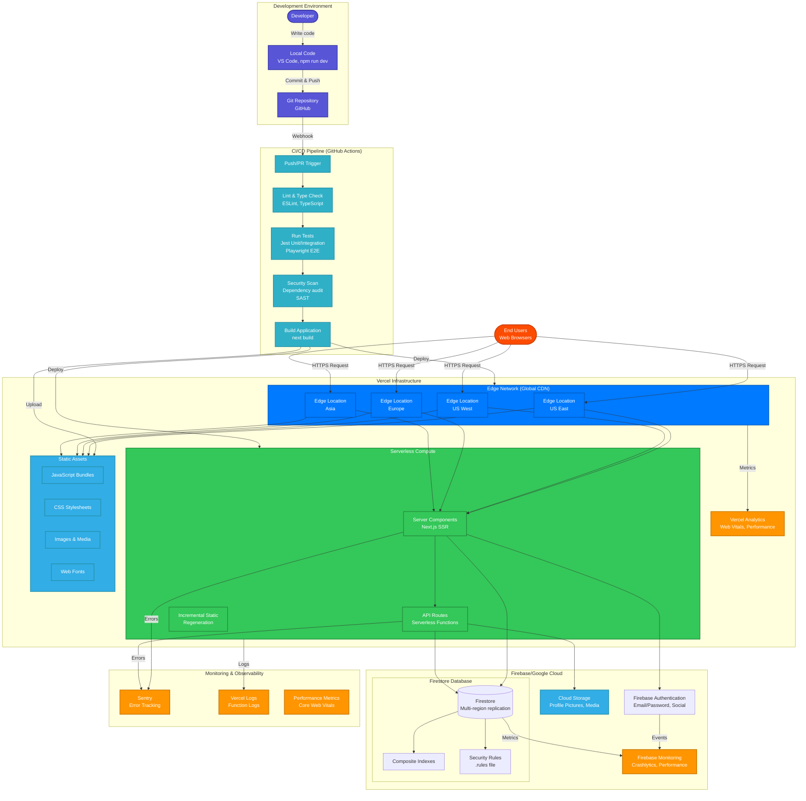

# Deployment Architecture

This diagram shows the complete deployment infrastructure for Ambira, including CI/CD pipeline, hosting, and backend services.



## Infrastructure Components

### 1. Development Environment

**Local Development**:

```bash
# Install dependencies
npm install

# Run development server
npm run dev

# Runs on http://localhost:3000
# Hot module replacement enabled
# TypeScript type checking in watch mode
```

**Development Tools**:

- VS Code with ESLint, Prettier extensions
- Firebase Emulators (optional, for local testing)
- Git for version control
- GitHub for collaboration

**Environment Variables** (`.env.local`):

```env
# Firebase Config
NEXT_PUBLIC_FIREBASE_API_KEY=...
NEXT_PUBLIC_FIREBASE_AUTH_DOMAIN=...
NEXT_PUBLIC_FIREBASE_PROJECT_ID=...
NEXT_PUBLIC_FIREBASE_STORAGE_BUCKET=...
NEXT_PUBLIC_FIREBASE_MESSAGING_SENDER_ID=...
NEXT_PUBLIC_FIREBASE_APP_ID=...

# Sentry (Optional)
NEXT_PUBLIC_SENTRY_DSN=...
SENTRY_AUTH_TOKEN=...
```

### 2. CI/CD Pipeline (GitHub Actions)

**Workflow File**: `.github/workflows/ci.yml`

**Triggered On**:

- Pull requests to `main`
- Pushes to `main`
- Manual workflow dispatch

**Pipeline Stages**:

#### Stage 1: Lint & Type Check

```yaml
- name: Lint
  run: npm run lint

- name: Type Check
  run: npm run type-check
```

**What it checks**:

- ESLint rules compliance
- TypeScript type errors
- Code formatting (Prettier)

#### Stage 2: Run Tests

```yaml
- name: Unit Tests
  run: npm test

- name: E2E Tests
  run: npm run test:smoke
```

**Test Coverage**:

- Jest unit and integration tests
- Playwright smoke tests (critical paths)
- Accessibility checks (WCAG 2.1 Level AA)

#### Stage 3: Security Scan

```yaml
- name: Dependency Audit
  run: npm audit --production

- name: Security Scan
  run: npm run security:scan
```

**Security Checks**:

- Vulnerable dependencies (npm audit)
- SAST (Static Application Security Testing)
- License compliance

#### Stage 4: Build

```yaml
- name: Build
  run: npm run build
  env:
    SKIP_ENV_VALIDATION: true
```

**Build Process**:

- Next.js production build
- TypeScript compilation
- CSS optimization
- Image optimization
- Bundle size analysis

**Deployment**:

- Automatic deployment to Vercel on success
- Preview deployments for PRs
- Production deployment for `main` branch

### 3. Vercel Edge Network

**Features**:

- Global CDN with 100+ edge locations
- Automatic HTTPS with SSL certificates
- DDoS protection
- Brotli compression
- HTTP/2 and HTTP/3 support

**Routing**:

```
User Request (https://ambira.app)
    ↓
Nearest Edge Location (e.g., US East)
    ↓
If Static Asset → Serve from Edge Cache
If Dynamic Page → Route to Serverless Function
If API Route → Invoke Serverless Function
```

**Caching Strategy**:

- **Static Assets**: Cached indefinitely (`Cache-Control: public, max-age=31536000, immutable`)
- **Dynamic Pages**: Revalidate on demand (ISR)
- **API Routes**: No caching (always fresh)

### 4. Serverless Compute (Vercel)

**Server Components** (Next.js SSR):

- Render pages on-demand
- Execute in serverless functions
- 10-second timeout
- Automatic scaling
- Cold start optimization

**API Routes**:

```typescript
// Example: /api/session/[id]
export async function GET(request: Request, { params }: { params: { id: string } }) {
  // Serverless function execution
  const session = await getSession(params.id)
  return Response.json(session)
}
```

**Resource Limits**:

- Function size: 50 MB (compressed)
- Execution timeout: 10s (Hobby), 60s (Pro)
- Concurrent executions: Auto-scaling
- Memory: 1024 MB default

### 5. Static Assets

**Build Output**:

```
.next/
├── static/
│   ├── chunks/          # JavaScript chunks
│   ├── css/             # CSS bundles
│   ├── media/           # Images, fonts
│   └── webpack/         # Webpack runtime
└── server/              # Server-side code
```

**Optimization**:

- **JavaScript**: Code splitting, tree shaking, minification
- **CSS**: Tailwind purge, minification, critical CSS
- **Images**: Next.js Image Optimization (WebP, AVIF)
- **Fonts**: Self-hosting, preload, font-display swap

**Bundle Analysis**:

```bash
npm run build -- --profile
# Analyze bundle size and optimization opportunities
```

### 6. Firebase/Google Cloud Backend

#### Firebase Authentication

**Configuration**:

- Email/password provider enabled
- Social providers: Google, GitHub (optional)
- Password policy: Min 6 characters
- Email verification: Optional

**Security**:

- HTTPS only
- Rate limiting (100 attempts/hour per IP)
- Account enumeration protection
- Brute force protection

#### Firestore Database

**Deployment Regions**:

- Primary: `us-central1`
- Multi-region replication
- Automatic failover

**Collections & Indexes**:

```javascript
// Composite indexes (firestore.indexes.json)
{
  "indexes": [
    {
      "collectionGroup": "sessions",
      "queryScope": "COLLECTION",
      "fields": [
        { "fieldPath": "visibility", "order": "ASCENDING" },
        { "fieldPath": "createdAt", "order": "DESCENDING" }
      ]
    },
    {
      "collectionGroup": "sessions",
      "queryScope": "COLLECTION",
      "fields": [
        { "fieldPath": "userId", "order": "ASCENDING" },
        { "fieldPath": "createdAt", "order": "DESCENDING" }
      ]
    }
  ]
}
```

**Security Rules Deployment**:

```bash
npx firebase-tools deploy --only firestore:rules --non-interactive
```

**Backup Strategy**:

- Automated daily backups (Firebase automatic)
- Point-in-time recovery (30-day retention)
- Export to Cloud Storage (weekly)

#### Cloud Storage

**Buckets**:

- `ambira-prod.appspot.com` - Profile pictures, media
- CORS configuration for client uploads
- CDN enabled via Firebase Hosting

**Upload Flow**:

```
Client → Generate signed URL (Firebase SDK)
      → Upload directly to Cloud Storage (client-side)
      → Update Firestore with storage path
```

### 7. Monitoring & Observability

#### Sentry Error Tracking

**Configuration** (`sentry.client.config.ts`):

```typescript
Sentry.init({
  dsn: process.env.NEXT_PUBLIC_SENTRY_DSN,
  environment: process.env.NODE_ENV,
  tracesSampleRate: 0.1,
  replaysSessionSampleRate: 0.1,
  replaysOnErrorSampleRate: 1.0,
})
```

**Features**:

- Real-time error alerts
- Stack trace analysis with source maps
- User session replay on errors
- Performance transaction tracking
- Release tracking

**Source Maps**:

```bash
# Uploaded automatically during build
sentry-cli sourcemaps upload --org=... --project=... .next/
```

#### Vercel Analytics

**Metrics Tracked**:

- Core Web Vitals (LCP, FID, CLS)
- Page load time
- Time to First Byte (TTFB)
- Function execution time
- Error rates

**Dashboard Access**:

- Vercel project dashboard
- Real User Monitoring (RUM)
- Geographic distribution
- Device/browser breakdown

#### Firebase Monitoring

**Firebase Performance**:

- App start time
- Screen rendering time
- HTTP request latency
- Firestore query performance

**Firebase Crashlytics**:

- Client-side crashes (future: mobile apps)
- Crash reports with stack traces
- User impact analysis

## Deployment Workflow

### 1. Pull Request (Preview Deployment)

```
Developer creates PR
    ↓
GitHub Actions runs CI/CD
    ↓ (if passing)
Vercel creates preview deployment
    ↓
Preview URL: https://ambira-pr-123.vercel.app
    ↓
Manual testing on preview
    ↓
Review & merge
```

**Preview Features**:

- Unique URL for each PR
- Automatic updates on new commits
- Same production environment
- Protected by Vercel auth (optional)

### 2. Production Deployment (main branch)

```
PR merged to main
    ↓
GitHub Actions runs full CI/CD
    ↓ (if passing)
Vercel deploys to production
    ↓
Domain: https://ambira.app
    ↓
Automatic rollback on errors (Vercel)
```

**Deployment Speed**:

- Build time: ~2-3 minutes
- Deployment time: ~30 seconds
- Total: ~3-4 minutes from merge to live

**Rollback**:

```bash
# Via Vercel CLI
vercel rollback

# Or via Vercel dashboard (one-click)
```

### 3. Firestore Rules Deployment

**Manual Deployment** (after modifying `firestore.rules`):

```bash
npx firebase-tools deploy --only firestore:rules --non-interactive
```

**Validation**:

```bash
# Test rules locally before deploying
npx firebase-tools emulators:start --only firestore
npm run test:security-rules
```

## Performance Optimization

### 1. Edge Caching

- Static assets cached at edge for 1 year
- ISR pages revalidated on-demand
- API routes bypass cache for freshness

### 2. Code Splitting

```typescript
// Automatic route-based splitting
const DashboardPage = lazy(() => import('./pages/dashboard'))

// Manual chunk splitting
const HeavyComponent = lazy(() => import('./components/Heavy'))
```

### 3. Image Optimization

```tsx
// Next.js Image component
<Image
  src="/profile.jpg"
  width={200}
  height={200}
  alt="Profile"
  loading="lazy"
  placeholder="blur"
/>
```

**Benefits**:

- Automatic WebP/AVIF conversion
- Responsive images (srcset)
- Lazy loading
- Blur placeholder

### 4. Database Optimization

- Composite indexes for all queries
- Firestore SDK caching
- React Query caching layer
- Batch reads where possible

## Security Measures

### 1. Infrastructure Security

- **HTTPS Everywhere**: Vercel automatic SSL
- **Firewall**: Vercel DDoS protection
- **Secrets**: Environment variables, not in code
- **CORS**: Configured for Firebase Storage

### 2. Application Security

- **Authentication**: Firebase Auth with JWT
- **Authorization**: Firestore security rules
- **Input Validation**: Zod schemas
- **XSS Protection**: React auto-escaping
- **CSRF Protection**: SameSite cookies

### 3. Dependency Security

- `npm audit` in CI/CD
- Dependabot automatic updates
- Lock file integrity checks
- SAST scanning

## Cost Optimization

### Vercel Costs

- **Hobby Plan**: Free (current)
- **Pro Plan**: $20/month (if needed)
- Bandwidth: First 100 GB free
- Function executions: Generous free tier

### Firebase Costs

**Firestore**:

- Reads: $0.06 per 100k
- Writes: $0.18 per 100k
- Storage: $0.18/GB/month

**Optimization**:

- React Query caching reduces reads
- Batch writes where possible
- Delete old data (retention policy)
- Monitor usage in Firebase Console

**Current Usage** (estimate):

- ~1M reads/month → $0.60
- ~200k writes/month → $0.36
- ~1 GB storage → $0.18
- **Total: ~$1/month**

### Sentry Costs

- **Developer Plan**: Free (5k events/month)
- **Team Plan**: $26/month (50k events)
- Automatic rate limiting
- Selective error sampling

## Disaster Recovery

### 1. Backup Strategy

**Firestore**:

- Automated daily backups (Firebase)
- 30-day point-in-time recovery
- Manual export capability

**Code**:

- Git version control (GitHub)
- Vercel deployment history (30 days)
- Rollback to any previous deployment

### 2. Incident Response

**Severity Levels**:

- **P0** (Critical): Service down → Immediate rollback
- **P1** (High): Major feature broken → Fix within 4 hours
- **P2** (Medium): Minor issue → Fix within 24 hours
- **P3** (Low): Enhancement/refactor → Scheduled

**Response Plan**:

1. Detect (Sentry alert, user report)
2. Assess (Check Vercel logs, Sentry)
3. Mitigate (Rollback or hotfix)
4. Communicate (Status page, team notification)
5. Post-mortem (Root cause analysis)

### 3. Failover

**Vercel**:

- Automatic failover across edge locations
- Health checks every 30 seconds
- Traffic rerouted to healthy regions

**Firebase**:

- Multi-region replication
- Automatic failover
- 99.99% uptime SLA

## Scaling Considerations

### Current Capacity

- **Concurrent Users**: ~1000
- **Requests/Second**: ~100
- **Database Reads/Day**: ~30k
- **Database Writes/Day**: ~5k

### Scaling Triggers

**When to scale up**:

- Concurrent users > 10k
- Response time > 3 seconds
- Error rate > 1%
- Database query latency > 500ms

**Scaling Options**:

1. **Vercel**: Automatic (upgrade to Pro if needed)
2. **Firestore**: Automatic scaling, no action needed
3. **Caching**: Increase React Query staleTime
4. **CDN**: Already optimized with Vercel Edge

## Environment Management

### Environments

**Development** (`localhost:3000`):

- Local Firebase emulators (optional)
- Hot reload enabled
- Debug mode

**Preview** (`*.vercel.app`):

- PR-based deployments
- Production-like environment
- Separate Firebase project (optional)

**Production** (`ambira.app`):

- Main branch only
- Production Firebase project
- Sentry enabled
- Analytics enabled

### Environment Variables

**Per Environment** (Vercel Dashboard):

```
Development:
  NEXT_PUBLIC_FIREBASE_PROJECT_ID=ambira-dev

Preview:
  NEXT_PUBLIC_FIREBASE_PROJECT_ID=ambira-staging

Production:
  NEXT_PUBLIC_FIREBASE_PROJECT_ID=ambira-prod
```

## Future Enhancements

### Planned Improvements

1. **CDN for Firestore**: Cloudflare proxy for read optimization
2. **Serverless Functions**: Background jobs (Firebase Functions)
3. **Real-time Updates**: Firestore listeners for live feed
4. **Mobile Apps**: React Native deployment (iOS, Android)
5. **GraphQL Layer**: Apollo Server for complex queries
6. **Redis Cache**: User session caching
7. **Message Queue**: Pub/Sub for async operations
